# Volume 1 — JavaScript Fundamentals (Explained Simply)

> Same topics as before, but explained in plain, everyday words — like a friend teaching you, not a textbook. Diagrams use Mermaid (works natively in Obsidian).

## Table of Contents
- [[#1. Introduction]]
- [[#2. History]]
- [[#3. ECMAScript]]
- [[#4. How JavaScript Works]]
- [[#5. Engines (V8, SpiderMonkey)]]
- [[#6. Browser Architecture]]
- [[#7. Runtime]]
- [[#8. Variables]]
- [[#9. Data Types]]
- [[#10. Operators]]
- [[#11. Type Conversion]]
- [[#12. Control Flow]]
- [[#13. Functions]]
- [[#14. Scope]]
- [[#15. Hoisting]]
- [[#16. Closures]]
- [[#17. Objects]]
- [[#18. Arrays]]
- [[#19. Modern ES6+]]
- [[#20. Coding Exercises]]
- [[#21. Interview Questions]]
- [[#22. Mini Projects]]

---

## 1. Introduction

JavaScript is the language that makes websites **do things** — not just sit there looking pretty. HTML builds the page, CSS makes it look nice, and JavaScript makes it *interactive*: buttons that click, forms that check your input, pages that update without reloading.

Think of a webpage like a car:
- **HTML** = the body/frame
- **CSS** = the paint job and interior design
- **JavaScript** = the engine that makes it move

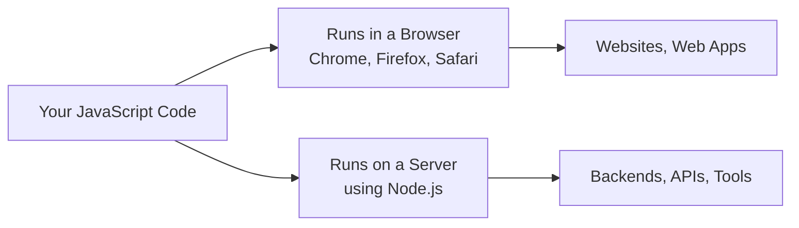

A few simple facts about JavaScript:
- You don't need to declare the "type" of a value ahead of time (it's flexible about that).
- It runs one instruction at a time, in order — but it has clever tricks (covered later) to handle things like waiting for data without freezing the page.
- It can be written in many styles — step-by-step instructions, working with objects, or working with functions.

---

## 2. History

Here's the story in simple terms:

| Year | What happened |
|---|---|
| 1995 | A programmer named Brendan Eich built the first version of JavaScript in just **10 days** for Netscape (an early browser company). |
| 1995 | It was renamed "JavaScript" mostly as a marketing move, to piggyback on the popularity of the Java language — the two languages aren't actually related. |
| 1996 | Microsoft made its own version for Internet Explorer, called JScript. |
| 1997 | Companies agreed on one official rulebook for the language, called **ECMAScript**, so it would work the same everywhere. |
| 2009 | **Node.js** came out — this let JavaScript run outside the browser, like on a server. Big deal, because now one language could do the whole job (frontend + backend). |
| 2015 | A huge update called **ES6** (or ES2015) added lots of modern features that made writing JavaScript much nicer. |
| Every year since | The language keeps getting small yearly updates, adding handy new features. |

---

## 3. ECMAScript

Think of **ECMAScript** as the official rulebook, and **JavaScript** as one popular implementation of that rulebook (there are others, but JavaScript is the main one everyone uses).

A group of people from different companies (called **TC39**) meet regularly and decide what new features get added to the rulebook. Before a new feature becomes official, it passes through stages — kind of like a food recipe getting tested before it goes on the restaurant menu:

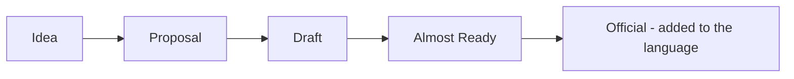

So when you hear "ES2015" or "ES2020," that just means "the version of the rulebook released in that year."

---

## 4. How JavaScript Works

When your computer runs JavaScript code, here's what happens in simple steps:

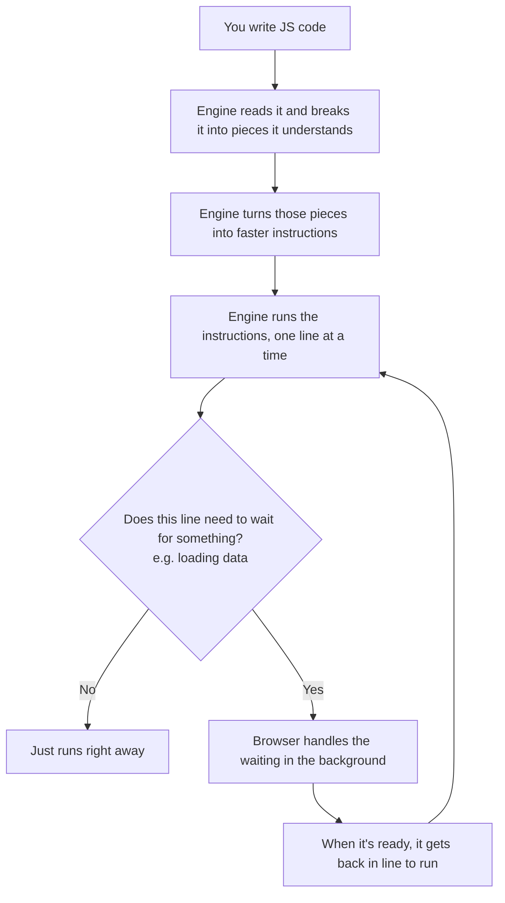

In short: JavaScript reads your code, translates it into something the computer can run quickly, and then runs it step by step — while cleverly handling anything that takes time (like fetching data from the internet) without freezing the whole page.

---

## 5. Engines (V8, SpiderMonkey)

A **JavaScript engine** is the program inside your browser that actually reads and runs your JavaScript code. Different browsers use different engines:

| Engine | Used by |
|---|---|
| **V8** | Google Chrome, Microsoft Edge, and also Node.js |
| **SpiderMonkey** | Mozilla Firefox |
| **JavaScriptCore** | Apple Safari |

All engines follow the same rulebook (ECMAScript), so your code should behave the same no matter which one runs it — but under the hood, each engine has its own tricks to make the code run fast.

Simple picture of how an engine like V8 speeds things up:

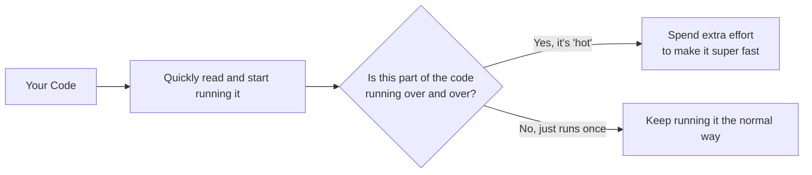

It's like a chef who notices you keep ordering the same dish — after a while, they prep the ingredients in advance so it comes out faster next time.

---

## 6. Browser Architecture

A browser is more complex than it looks. When you open a webpage, several parts work together:

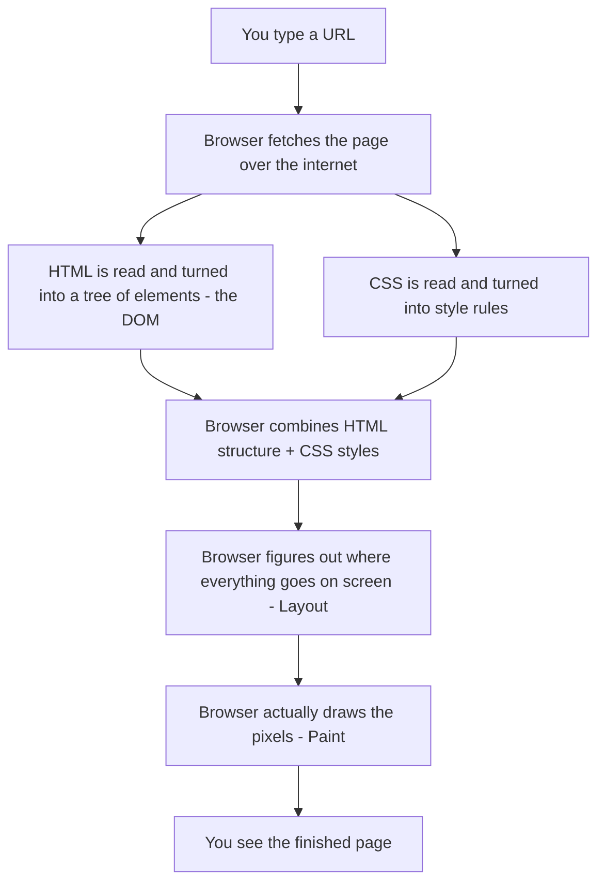

Also, modern browsers like Chrome run each tab in its own separate little "box" (process) — so if one tab crashes or has a problem, it usually doesn't take down your other tabs.

---

## 7. Runtime

The **runtime** is basically "everything JavaScript has access to while it's running" — not just the core language, but extra tools the browser (or Node.js) provides, like the ability to talk to the webpage, wait a few seconds, or fetch data from the internet.

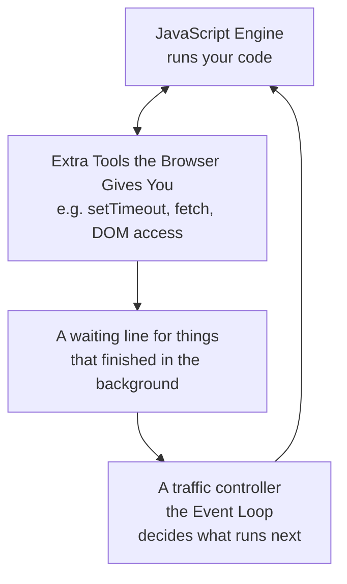

Simple way to think about it: your JavaScript engine is like a chef who can only do one thing at a time. The "runtime" is like having helpers in the kitchen who go do slow tasks (like waiting for delivery) so the chef doesn't have to stand around — and there's a manager (the event loop) who hands the chef the next task once they're free.

(We'll dig much deeper into this in Volume 3.)

---

## 8. Variables

Variables are just **labeled boxes** where you store information so you can use it later.

```javascript
var a = 1;      // old way of making a box - has some quirks, avoid using it in new code
let b = 2;      // modern way - the value inside CAN change later
const c = 3;    // modern way - the value CANNOT be reassigned later
```

Simple rules:
- Use **`const`** by default — it's the safest choice when the value won't need to change.
- Use **`let`** only when you know the value will need to change later (like a counter).
- Avoid **`var`** in new code — it behaves in confusing ways compared to `let`/`const`.

```javascript
const obj = { x: 1 };
obj.x = 2;      // ✅ this is fine! `const` only locks the box, not what's inside it
// obj = {};    // ❌ this is NOT allowed - you can't put a whole new box in
```

---

## 9. Data Types

Every value in JavaScript has a "type" — a category describing what kind of thing it is.

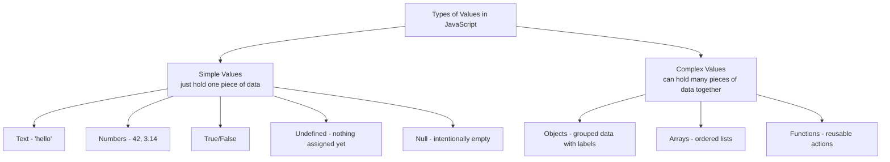

```javascript
typeof "hi"         // "string"  -> it's text
typeof 42            // "number"  -> it's a number
typeof true           // "boolean" -> it's true or false
typeof undefined       // "undefined" -> nothing has been put in this box yet
typeof null             // "object"  -> a well-known quirky bug in JavaScript, but it really means "empty on purpose"
typeof {}                // "object"  -> it's a grouped set of data
typeof []                 // "object"  -> arrays are technically a special kind of object
typeof function(){}        // "function" -> it's an action you can run
```

Simple values (`string`, `number`, `boolean`, `undefined`, `null`) get **copied** when you assign them somewhere new. Complex values (`object`, `array`, `function`) get **shared** — two variables can point to the same thing.

---

## 10. Operators

Operators are the symbols you use to do things with values — math, comparisons, logic.

```javascript
// Math
5 + 3   // 8
5 - 3   // 2
5 * 3   // 15
5 / 3   // 1.666...
5 % 3   // 2 (the leftover after dividing - "remainder")

// Comparing values
5 == "5"    // true  -> loosely checks, ignores type differences
5 === "5"   // false -> strictly checks, type must match too (safer choice!)
5 != "5"    // false
5 !== "5"   // true

// Logic
true && false   // false  -> "and": both must be true
true || false   // true   -> "or": at least one must be true
!true           // false  -> "not": flips true/false

// Shorthand decision-making
const age = 20;
const label = age >= 18 ? "adult" : "minor"; // if/else in one line
```

**Golden rule:** always prefer `===` and `!==` over `==` and `!=` — the "strict" versions avoid weird surprises where JavaScript tries to guess what you meant.

---

## 11. Type Conversion

Sometimes JavaScript needs to change a value from one type to another — like turning the text `"5"` into the number `5`. This can happen automatically (JavaScript guessing what you want) or on purpose (you telling it exactly what to do).

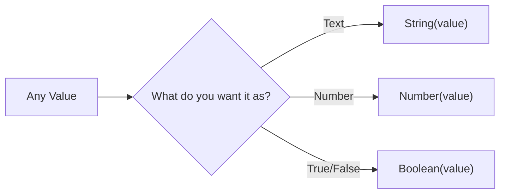

```javascript
Number("123")     // 123        -> text that looks like a number, converted
Number("abc")     // NaN        -> "Not a Number" - it couldn't convert
String(123)       // "123"      -> number turned into text
Boolean("")       // false      -> empty text counts as "false-ish"
Boolean("hello")  // true       -> any non-empty text counts as "true-ish"
```

Values that count as "false-ish" (JavaScript calls these **falsy**): `false`, `0`, empty text `""`, `null`, `undefined`, and `NaN`. Everything else counts as "true-ish" (**truthy**) — even things you might not expect, like an empty array `[]` or empty object `{}`.

**Watch out for automatic conversion surprises:**
```javascript
"5" + 3     // "53"  -> the number got turned into text and joined together
"5" - 3     // 2     -> here it converted the text into a number instead
```
This is exactly why `===` (which doesn't do any converting) is usually the safer choice.

---

## 12. Control Flow

"Control flow" just means: **which lines of code run, and in what order** — based on conditions or repetition.

```javascript
// Making decisions
if (score > 90) {
  grade = "A";
} else if (score > 75) {
  grade = "B";
} else {
  grade = "C";
}

// Choosing between many options
switch (day) {
  case "Mon":
    doWork();
    break;
  default:
    relax();
}

// Repeating something
for (let i = 0; i < 5; i++) {
  console.log(i); // runs 5 times, i = 0,1,2,3,4
}

let count = 0;
while (count < 3) {
  count++;
}
```

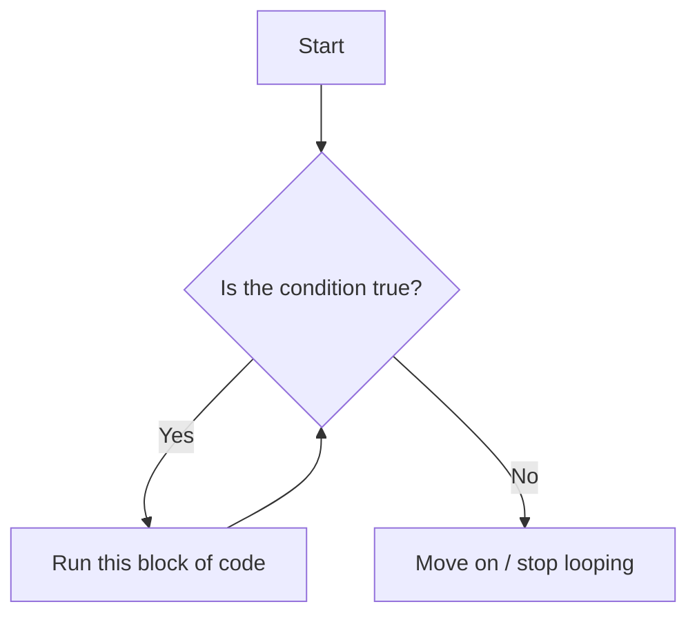

Think of a loop like a chore: "keep doing this **while** the condition is true" or "do this **for** a set number of times."

---

## 13. Functions

A function is a **reusable recipe** — you write the steps once, then "call" the function whenever you want those steps to run.

```javascript
// Basic function
function add(a, b) {
  return a + b;
}
add(2, 3); // 5

// A shorter, modern way to write functions
const multiply = (a, b) => a * b;

// Giving a default value if nothing is passed in
function greet(name = "Guest") {
  return `Hi ${name}`;
}
greet();          // "Hi Guest"
greet("Riya");    // "Hi Riya"

// Accepting "however many" arguments
function sum(...numbers) {
  return numbers.reduce((total, n) => total + n, 0);
}
sum(1, 2, 3, 4); // 10
```

Simple way to think of it: a function is like a coffee machine. You put in ingredients (**arguments**), it does its thing, and it gives you a result (**return value**) — you can use that machine again and again without rebuilding it each time.

---

## 14. Scope

"Scope" answers the question: **from where in my code can I actually see and use this variable?**

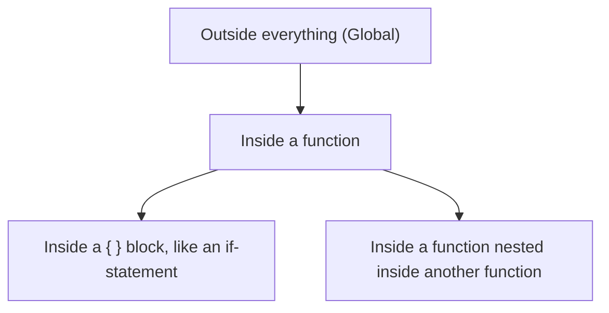

```javascript
let x = "outside";

function outer() {
  let x = "in outer";
  function inner() {
    let x = "in inner";
    console.log(x); // "in inner" - it looks for x starting from the closest place first
  }
  inner();
}
```

Simple rule: JavaScript looks for a variable starting from **right where you are**, and if it's not found there, it looks one level out, then the next level out, and so on — like asking your roommate first, then your neighbor, then your whole street.

- Anything declared with `let`/`const` inside `{ }` (like an `if` block or loop) only exists inside those curly braces.
- Anything declared with `var` inside a function exists throughout that whole function, ignoring inner `{ }` blocks (this is one of the confusing quirks of `var`).

---

## 15. Hoisting

**Hoisting** is a quirky JavaScript behavior: before your code actually runs, JavaScript quickly scans through it and "sets up" all the variable and function names in advance.

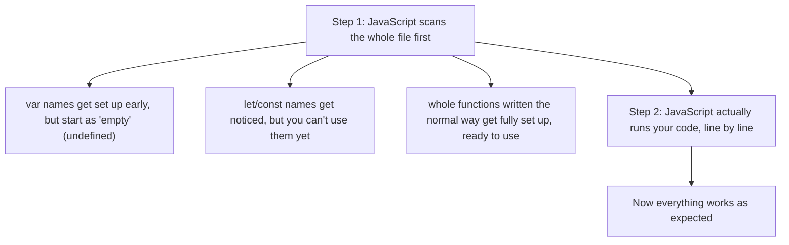

```javascript
console.log(a); // undefined - it exists, but has no value yet
var a = 5;

console.log(b); // ❌ Error! Can't use it before this line
let b = 5;

sayHi(); // ✅ "Hi!" - works! functions written this way are ready early
function sayHi() {
  console.log("Hi!");
}
```

Simple takeaway: it's like everyone's name being written on a seating chart before the party starts — but for `let`/`const`, the "seat" is reserved yet blocked off (you can't sit there) until that line of code actually runs.

---

## 16. Closures

A **closure** is what happens when a function "remembers" the variables from the place it was created — even after that outer place has already finished running.

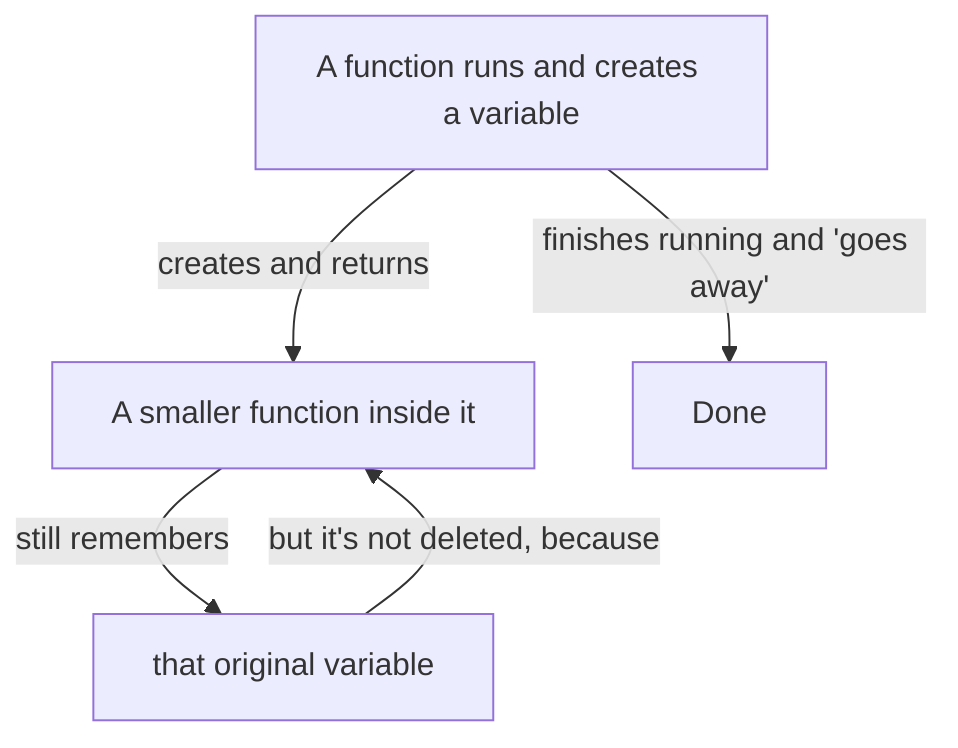

```javascript
function makeCounter() {
  let count = 0;
  return function () {
    count++;
    return count;
  };
}

const counter = makeCounter();
counter(); // 1
counter(); // 2 — it remembers `count` from before, like a private notebook only it can see
```

Simple way to picture it: imagine a function as a backpack. When it's created, it packs up any variables it might need later. Even after you leave the room (the outer function finishes), the backpack still has those items in it.

This is really useful for things like counters, or keeping some data "private" so nothing else can mess with it directly.

---

## 17. Objects

An **object** is a way to group related information together using labels (called "keys").

```javascript
const person = {
  name: "Riya",
  age: 28,
  greet() {
    return `Hi, I'm ${this.name}`;
  },
};

person.name;       // "Riya"  - reading a value
person["age"];      // 28      - another way to read a value

person.city = "Mumbai";  // adding something new
delete person.age;         // removing something

// Grabbing multiple values at once, quickly
const { name, age = 30 } = person; // if `age` doesn't exist, use 30 as default

// Making a copy (and maybe changing a value while doing it)
const clone = { ...person, city: "Pune" };
```

Think of an object like a filing cabinet: each drawer has a label (`name`, `age`) and something inside it. You can add drawers, remove them, or peek inside whenever you want.

**Copying carefully:** a simple copy (`{ ...person }`) only copies the top layer — if there's an object *inside* the object, both copies will still share that inner part. If you need a completely independent copy, use `structuredClone(person)`.

---

## 18. Arrays

An **array** is an ordered list of items.

```javascript
const fruits = ["apple", "banana", "cherry"];

fruits.push("date");      // add to the end
fruits.pop();               // remove from the end
fruits[0];                    // "apple" - get the first item (lists start counting at 0!)

// Common, very useful list operations:
fruits.map(f => f.toUpperCase());        // make a NEW list, transforming each item
fruits.filter(f => f.startsWith("a"));    // make a NEW list, keeping only some items
fruits.reduce((total, f) => total + 1, 0); // combine everything into one single result

fruits.includes("banana"); // true - does the list contain this?
fruits.find(f => f === "banana"); // find the first matching item

// Splitting a list apart into named pieces
const [first, second, ...rest] = fruits;
```

Simple mental picture: an array is like a numbered shelf. Item #1 is at position 0, item #2 is at position 1, and so on. `map`, `filter`, and `reduce` are your three best friends for working with lists — they let you transform a list without writing manual loops.

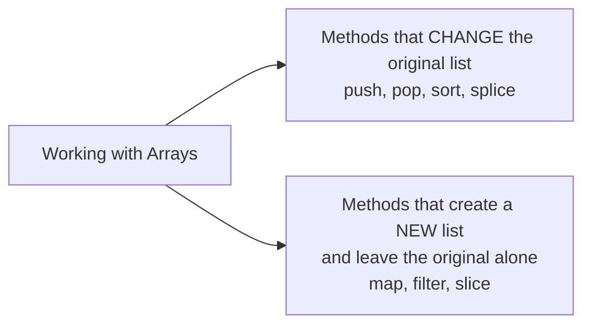

---

## 19. Modern ES6+

Over the years, JavaScript added lots of small conveniences that make code shorter and easier to read. Here are the big ones, explained simply:

```javascript
// Instead of clunky string joining, just drop variables right into text:
const msg = `Hello, ${name}! You are ${age} years old.`;

// A quick way to build a "class" of things (like a blueprint for objects):
class Animal {
  constructor(name) {
    this.name = name;
  }
  speak() {
    return `${this.name} makes a sound`;
  }
}
class Dog extends Animal {
  speak() {
    return `${this.name} barks`;
  }
}

// Splitting code across multiple files, and reusing pieces:
export const PI = 3.14;              // in one file
import { PI } from "./file.js";      // in another file

// Safely reading deeply nested data, without crashing if something's missing:
const city = user?.address?.city ?? "Unknown";
// translation: "get user's address's city if it exists, otherwise say 'Unknown'"

// Handling things that take time (like loading data) in a readable way:
async function getData() {
  const response = await fetch("/api");
  return response.json();
}
```

**Quick-reference — what got added each year (simple version):**

| Year | What it made easier |
|---|---|
| 2015 (ES6) | `let`/`const`, classes, arrow functions, better text formatting, splitting code into files |
| 2017 | `async`/`await` — makes waiting for things read like normal step-by-step code |
| 2019 | Easier ways to flatten lists and work with objects |
| 2020 | Safer ways to read nested data without crashing (`?.` and `??`) |
| 2022 | Truly private data inside classes (`#privateField`) |

---

## 20. Coding Exercises

Try these to practice — start simple, and don't worry about getting it perfect the first time:

1. Reverse a piece of text without using a built-in "reverse" function.
2. Check if a word reads the same backward as forward (a palindrome).
3. Find the biggest number in a list, without using `Math.max`.
4. Remove duplicate items from a list.
5. Flatten a list-of-lists into one single flat list.
6. Write a function that only runs after someone stops typing for half a second (called "debounce").
7. Copy an object so that changing the copy never affects the original.
8. Build your own simplified version of `.map()`.
9. Make a counter (using a closure) that can go up, go down, or reset.
10. Print "Fizz" for multiples of 3, "Buzz" for multiples of 5, and "FizzBuzz" for both, from 1 to 100.
11. Find the first letter in a piece of text that doesn't repeat.
12. Group a list of objects by one of their properties (e.g., group people by city).

```javascript
// Example solution — "wait until typing stops" (debounce)
function debounce(fn, delay) {
  let timer;
  return (...args) => {
    clearTimeout(timer);
    timer = setTimeout(() => fn(...args), delay);
  };
}
```

---

## 21. Interview Questions

**Simple explanations you should be able to give out loud:**

1. What's the difference between `var`, `let`, and `const`? *(Hint: where can each be used, and can you change the value later?)*
2. What is hoisting? *(Hint: JavaScript "sets up" names before running the code.)*
3. What is a closure? *(Hint: a function that remembers variables from where it was created.)*
4. What's the difference between `==` and `===`? *(Hint: one converts types automatically, the other doesn't.)*
5. What's the difference between `null` and `undefined`? *(Hint: one is "on purpose empty," the other is "nothing assigned yet.")*
6. What does `this` refer to inside a regular function versus an arrow function? *(Covered more in Volume 3.)*
7. What's the difference between copying an object shallowly versus deeply?
8. What are truthy and falsy values? Can you name the 8 falsy values?
9. What is the difference between synchronous and asynchronous code?
10. Why does `typeof null` return `"object"`? *(It's a known old bug that was never fixed, to avoid breaking old websites.)*

**Guess the output (good practice for understanding quirks):**
```javascript
console.log(1 + "1");      // "11" - number joined with text
console.log(1 + +"1");     // 2   - the extra + converts "1" into a number first
console.log([] == false);  // true - a quirky automatic conversion
console.log(typeof NaN);   // "number" - yes, "Not a Number" is technically a number type!
```

---

## 22. Mini Projects

Small, no-frills projects to practice everything above (no need for a real webpage — you can just run these and print results):

1. **To-Do List** — keep a list of tasks (as an array of objects), and write functions to add, remove, and mark tasks as done.
2. **Simple Calculator** — write functions for add/subtract/multiply/divide, and pick which one to use based on user input.
3. **Number Guessing Game** — the computer picks a random number, and you write logic to check guesses ("too high," "too low," "correct!").
4. **Contact Book** — store a list of contacts (objects), and let people search, add, or delete entries.
5. **Expense Tracker** — keep a list of expenses, and use `reduce` to calculate totals, `filter` to see spending by category.
6. **Word Counter** — take a paragraph of text and count how many times each word appears.

> Next: **Volume 2 — Intermediate JavaScript** (working with real webpages: clicking buttons, loading data, forms, and more).
