# Volume 1 — JavaScript Fundamentals

> Companion notes for Obsidian. Diagrams use Mermaid (native Obsidian support). Use `Ctrl/Cmd+Shift+F` to search this vault.

## Table of Contents
- [[#1. Introduction]]
- [[#2. History]]
- [[#3. ECMAScript]]
- [[#4. How JavaScript Works]]
- [[#5. Engines (V8, SpiderMonkey)]]
- [[#6. Browser Architecture]]
- [[#7. Runtime]]
- [[#8. Variables]]
- [[#9. Data Types]]
- [[#10. Operators]]
- [[#11. Type Conversion]]
- [[#12. Control Flow]]
- [[#13. Functions]]
- [[#14. Scope]]
- [[#15. Hoisting]]
- [[#16. Closures]]
- [[#17. Objects]]
- [[#18. Arrays]]
- [[#19. Modern ES6+]]
- [[#20. Coding Exercises]]
- [[#21. Interview Questions]]
- [[#22. Mini Projects]]

---

## 1. Introduction

JavaScript (JS) is a **high-level, interpreted (JIT-compiled), single-threaded, multi-paradigm** programming language. It supports:
- Procedural programming
- Object-oriented programming (prototype-based)
- Functional programming

**Where it runs:**
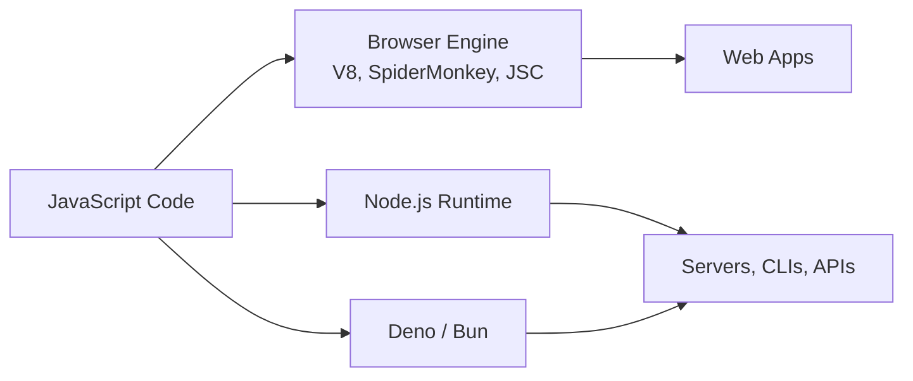

Key traits: dynamically typed, weakly typed, prototype-based OOP, first-class functions, single-threaded with an event loop for async work.

---

## 2. History

| Year | Milestone |
|---|---|
| 1995 | Brendan Eich creates "Mocha" (later LiveScript) at Netscape in 10 days |
| 1995 | Renamed **JavaScript** (marketing tie-in with Java) |
| 1996 | Microsoft releases JScript (IE) |
| 1997 | **ECMAScript 1** standard published (ECMA-262) |
| 1999 | ES3 — regex, try/catch |
| 2009 | **ES5** — strict mode, JSON, Array methods |
| 2009 | Node.js released (Ryan Dahl) — JS on the server |
| 2015 | **ES6/ES2015** — classes, modules, let/const, arrow fns, promises |
| 2016+ | Annual release cycle (ES2016, ES2017 …) |
| 2020 | ES2020 — optional chaining, nullish coalescing, BigInt |
| Present | TC39 continues yearly proposals (Stage 0 → 4) |

---

## 3. ECMAScript

ECMAScript (ES) is the **specification** JavaScript implements. Governed by **TC39** committee under Ecma International.

**Proposal stages:**
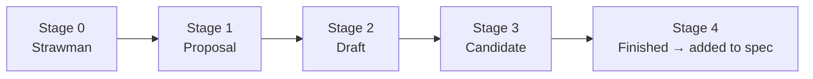

- **JavaScript** = ECMAScript + Web APIs (DOM, fetch, etc.) + host environment features.
- Engines implement ECMAScript; browsers/Node add extra APIs on top.

---

## 4. How JavaScript Works

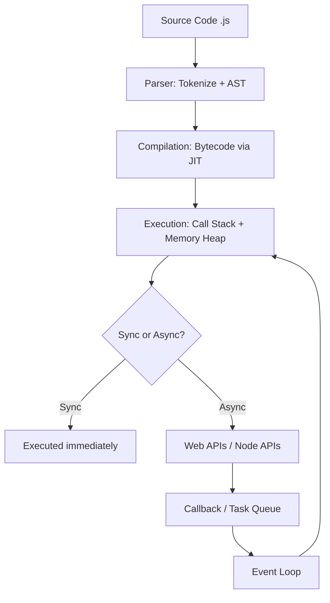

JS uses **Just-In-Time (JIT) compilation**: code is parsed to an AST, compiled to bytecode, and hot code paths are further optimized into machine code at runtime (not purely interpreted, not purely ahead-of-time compiled).

---

## 5. Engines (V8, SpiderMonkey)

| Engine | Used In | Maker |
|---|---|---|
| **V8** | Chrome, Edge, Node.js, Deno | Google |
| **SpiderMonkey** | Firefox | Mozilla |
| **JavaScriptCore (JSC)** | Safari | Apple |
| **Chakra** | Legacy Edge | Microsoft |

**V8 pipeline:**
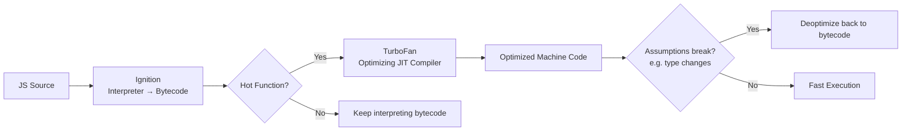

Engine responsibilities: parsing, compiling, executing, memory allocation (heap), and garbage collection.

---

## 6. Browser Architecture

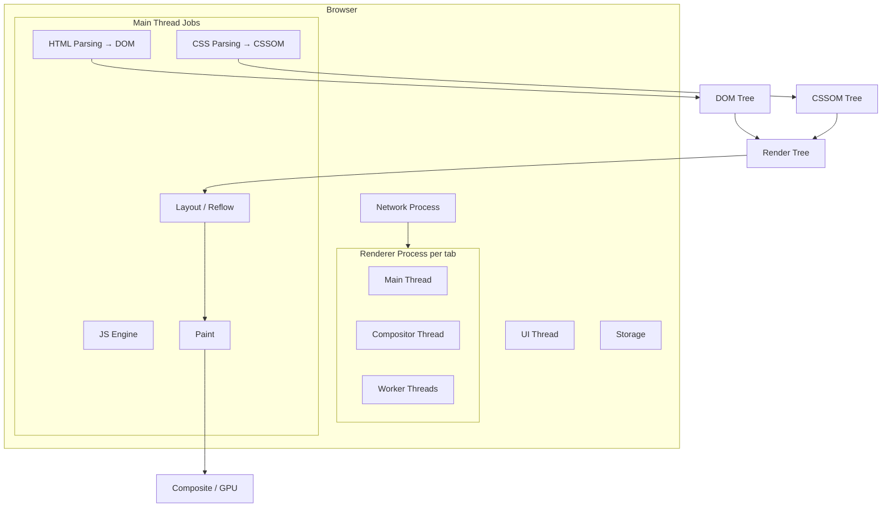

Multi-process architecture (Chromium): Browser process, Renderer process(es), GPU process, Network process, Plugin process — isolates tabs for security/stability (site isolation).

---

## 7. Runtime

The **JS Runtime Environment** = Engine + Web APIs + Callback Queue + Event Loop.

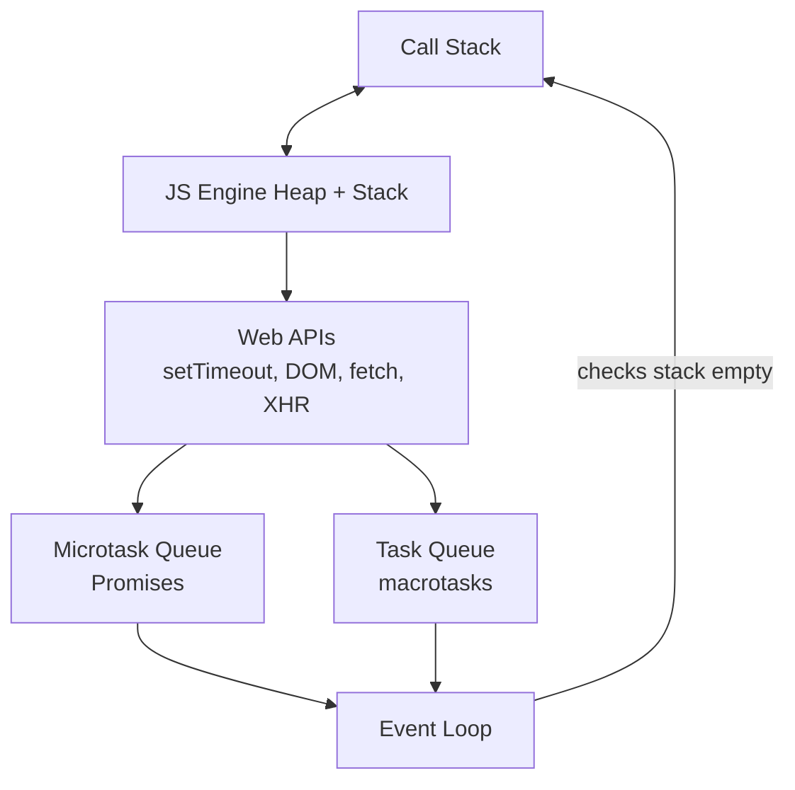

Node.js runtime swaps browser Web APIs for **libuv** (file system, networking, timers).

---

## 8. Variables

```javascript
var a = 1;      // function-scoped, hoisted, re-declarable
let b = 2;      // block-scoped, not re-declarable, TDZ
const c = 3;    // block-scoped, immutable binding (not deep-frozen)

// const with objects — binding is fixed, contents mutable
const obj = { x: 1 };
obj.x = 2;       // ✅ allowed
// obj = {};     // ❌ TypeError
```

| Feature | `var` | `let` | `const` |
|---|---|---|---|
| Scope | Function | Block | Block |
| Hoisted | Yes (init `undefined`) | Yes (TDZ) | Yes (TDZ) |
| Re-declare | Yes | No | No |
| Re-assign | Yes | Yes | No |

---

## 9. Data Types

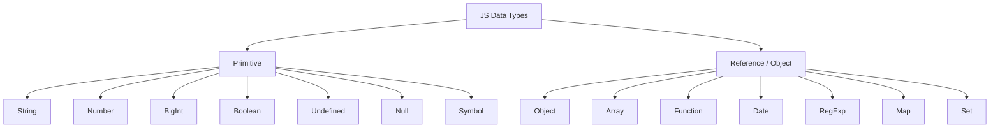

```javascript
typeof "hi"        // "string"
typeof 42           // "number"
typeof 10n           // "bigint"
typeof true          // "boolean"
typeof undefined     // "undefined"
typeof null          // "object" (famous JS bug)
typeof Symbol()       // "symbol"
typeof {}             // "object"
typeof []              // "object"
typeof function(){}     // "function"
```

Primitives are **immutable** and copied **by value**. Objects are copied **by reference**.

---

## 10. Operators

```javascript
// Arithmetic
+  -  *  /  %  **

// Assignment
=  +=  -=  *=  /=  **=  ??=  ||=  &&=

// Comparison
==  ===  !=  !==  >  <  >=  <=

// Logical
&&  ||  !  ??

// Ternary
const result = age >= 18 ? "adult" : "minor";

// Bitwise
&  |  ^  ~  <<  >>  >>>

// Others
typeof  instanceof  in  delete  void  ...spread/rest
```

`==` vs `===`:
```javascript
0 == "0"     // true  (coercion)
0 === "0"    // false (strict, no coercion)
null == undefined   // true
null === undefined  // false
```

---

## 11. Type Conversion

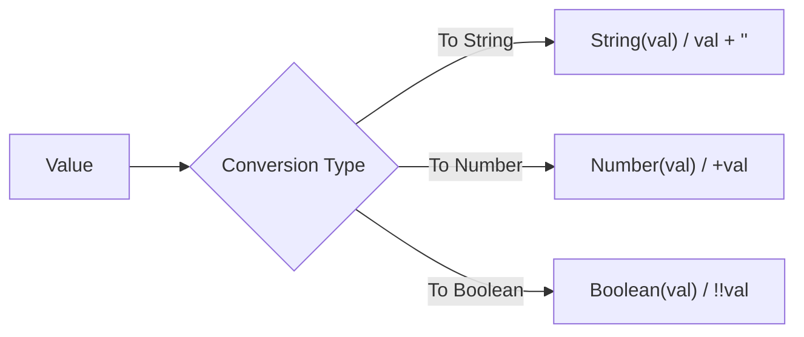

**Falsy values (only 8):** `false, 0, -0, 0n, "", null, undefined, NaN`
Everything else is truthy (including `"0"`, `[]`, `{}`).

```javascript
Number("123")     // 123
Number("abc")     // NaN
Number(true)      // 1
Number(null)      // 0
Number(undefined) // NaN
String(123)       // "123"
Boolean("")       // false
Boolean("0")      // true (non-empty string!)

// Implicit coercion gotchas
"5" + 3     // "53" (string concat)
"5" - 3     // 2   (numeric)
[] + []     // ""
[] + {}     // "[object Object]"
```

---

## 12. Control Flow

```javascript
// if / else
if (score > 90) grade = "A";
else if (score > 75) grade = "B";
else grade = "C";

// switch
switch (day) {
  case "Mon": doWork(); break;
  default: relax();
}

// loops
for (let i = 0; i < 5; i++) {}
for (const key in obj) {}      // enumerable keys
for (const val of arr) {}      // iterable values
while (cond) {}
do { } while (cond);

// break / continue
for (let i = 0; i < 10; i++) {
  if (i === 3) continue;
  if (i === 7) break;
}
```

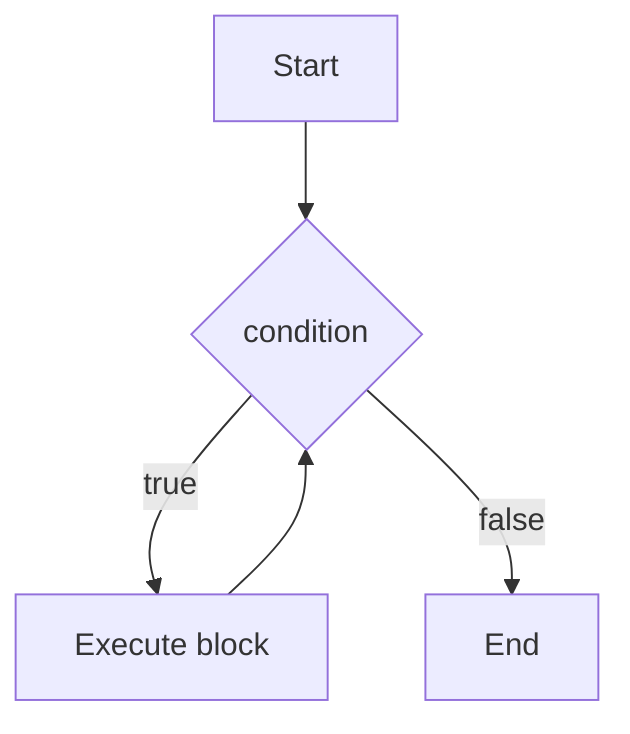

---

## 13. Functions

```javascript
// Declaration (hoisted fully)
function add(a, b) { return a + b; }

// Expression (not hoisted as callable)
const sub = function (a, b) { return a - b; };

// Arrow function (no own this/arguments)
const mul = (a, b) => a * b;

// Default params
function greet(name = "Guest") { return `Hi ${name}`; }

// Rest params
function sum(...nums) { return nums.reduce((a, b) => a + b, 0); }

// IIFE
(function () { console.log("runs immediately"); })();

// Higher-order function
function withLogging(fn) {
  return (...args) => { console.log("call", args); return fn(...args); };
}
```

**Function vs Arrow:**
| Feature | Regular Function | Arrow Function |
|---|---|---|
| `this` | Dynamic (call-site) | Lexical (inherited) |
| `arguments` object | Yes | No |
| Constructor (`new`) | Yes | No |
| Hoisting | Fully (declarations) | No |

---

## 14. Scope

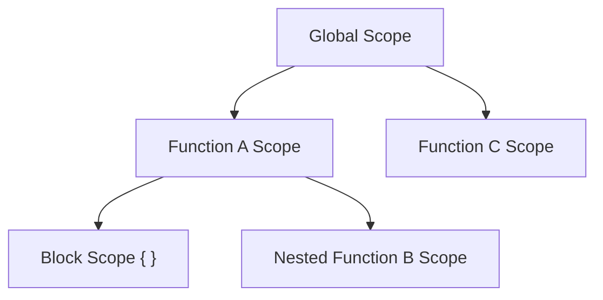

```javascript
let x = "global";
function outer() {
  let x = "outer";
  function inner() {
    let x = "inner";
    console.log(x); // "inner" — scope chain resolves nearest first
  }
  inner();
}
```

- **Global scope** — accessible everywhere.
- **Function scope** — `var` lives here.
- **Block scope** — `let`/`const` live here (`{}`, `if`, `for`).
- **Lexical scoping** — scope determined by where code is *written*, not called.

---

## 15. Hoisting

JS moves **declarations** to the top of their scope during the *creation phase*, before execution.

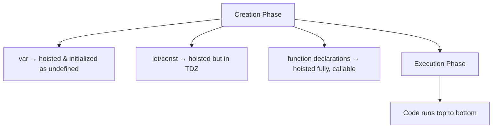

```javascript
console.log(a); // undefined (not error)
var a = 5;

console.log(b); // ❌ ReferenceError (Temporal Dead Zone)
let b = 5;

sayHi(); // "Hi!" — works, fully hoisted
function sayHi() { console.log("Hi!"); }

sayBye(); // ❌ TypeError: sayBye is not a function
var sayBye = function () { console.log("Bye"); };
```

**TDZ (Temporal Dead Zone):** the time between entering scope and the `let`/`const` declaration line, during which the variable exists but cannot be accessed.

---

## 16. Closures

A closure is a function that **remembers the variables from its lexical scope**, even after the outer function has returned.

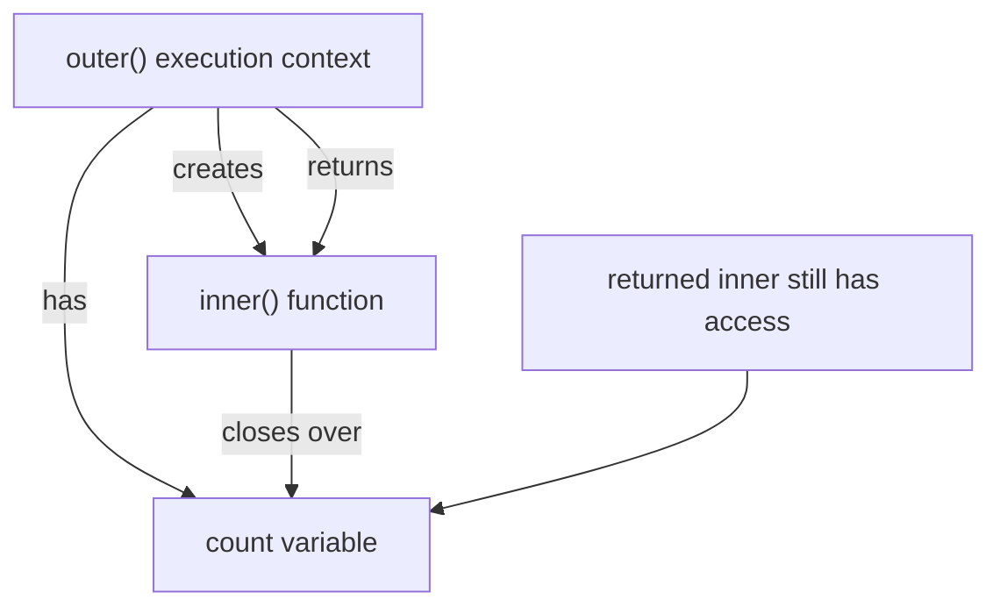

```javascript
function makeCounter() {
  let count = 0;
  return function () {
    count++;
    return count;
  };
}

const counter = makeCounter();
counter(); // 1
counter(); // 2  — `count` persists between calls, private to counter

// Classic use: private data / module pattern
function bankAccount(balance) {
  return {
    deposit: (amt) => (balance += amt),
    getBalance: () => balance,
  };
}
```

**Common pitfall — loop + closure:**
```javascript
for (var i = 0; i < 3; i++) {
  setTimeout(() => console.log(i), 0); // 3 3 3 (var is shared)
}
for (let j = 0; j < 3; j++) {
  setTimeout(() => console.log(j), 0); // 0 1 2 (let is per-iteration)
}
```

---

## 17. Objects

```javascript
const person = {
  name: "Riya",
  age: 28,
  greet() { return `Hi, I'm ${this.name}`; },
};

// Access
person.name;
person["age"];

// Add / delete
person.city = "Mumbai";
delete person.age;

// Object methods
Object.keys(person);
Object.values(person);
Object.entries(person);
Object.assign({}, person);
Object.freeze(person);   // shallow immutability
Object.create(proto);

// Destructuring
const { name, age = 30 } = person;

// Shorthand & computed keys
const x = 1, y = 2;
const point = { x, y, [`key_${x}`]: "dynamic" };

// Spread (shallow clone / merge)
const clone = { ...person, city: "Pune" };
```

**Deep vs shallow copy:**
```javascript
const shallow = { ...person };                 // nested objects still shared
const deep = structuredClone(person);           // true deep clone (modern)
const deepJSON = JSON.parse(JSON.stringify(person)); // loses functions/undefined
```

---

## 18. Arrays

```javascript
const arr = [1, 2, 3, 4, 5];

// Mutating
arr.push(6); arr.pop(); arr.shift(); arr.unshift(0);
arr.splice(1, 2, "a", "b");
arr.sort(); arr.reverse();

// Non-mutating / functional
arr.map(x => x * 2);
arr.filter(x => x > 2);
arr.reduce((acc, x) => acc + x, 0);
arr.find(x => x === 3);
arr.findIndex(x => x === 3);
arr.some(x => x > 4);
arr.every(x => x > 0);
arr.includes(3);
arr.slice(1, 3);
arr.flat(); arr.flatMap(x => [x, x * 2]);
arr.join("-");
[...arr]; // spread clone
Array.from({ length: 5 }, (_, i) => i);
Array.isArray(arr);

// Destructuring
const [first, second, ...rest] = arr;
```

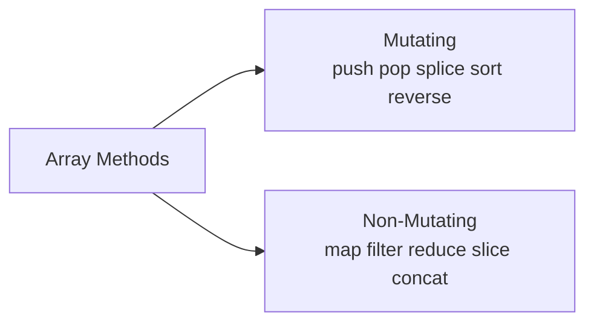

---

## 19. Modern ES6+

```javascript
// Template literals
const msg = `Hello, ${name}! Total: ${1 + 1}`;

// let/const, arrow fns — covered above

// Destructuring (nested)
const { a: { b } } = { a: { b: 1 } };

// Spread / Rest
const merged = [...arr1, ...arr2];
function fn(...args) {}

// Default + optional chaining + nullish coalescing
const city = user?.address?.city ?? "Unknown";

// Classes
class Animal {
  #privateField = "secret";      // private field (ES2022)
  static count = 0;
  constructor(name) { this.name = name; Animal.count++; }
  speak() { return `${this.name} makes a sound`; }
}
class Dog extends Animal {
  speak() { return `${super.speak()} — Woof!`; }
}

// Modules
export const PI = 3.14;
export default function main() {}
import main, { PI } from "./file.js";

// Promises / async-await (deep dive in Vol 2)
async function getData() {
  const res = await fetch("/api");
  return res.json();
}

// Symbols, Map, Set
const map = new Map([["a", 1]]);
const set = new Set([1, 2, 2, 3]); // {1,2,3}

// Generators
function* gen() { yield 1; yield 2; }

// Optional chaining + nullish
obj?.method?.();
const val = input ?? "default";
```

**ES version quick-reference:**
| Version | Key Additions |
|---|---|
| ES2015 (ES6) | let/const, classes, arrow fns, promises, modules, template literals |
| ES2016 | `Array.prototype.includes`, `**` exponent |
| ES2017 | async/await, `Object.entries/values` |
| ES2018 | rest/spread for objects, async iteration |
| ES2019 | `flat`, `flatMap`, `Object.fromEntries` |
| ES2020 | optional chaining `?.`, nullish `??`, BigInt, `Promise.allSettled` |
| ES2021 | `replaceAll`, logical assignment `??=` `||=` `&&=` |
| ES2022 | class private fields `#x`, top-level `await`, `.at()` |
| ES2023 | `toSorted`, `toReversed`, `findLast` |
| ES2024 | `Object.groupBy`, Promise.withResolvers |

---

## 20. Coding Exercises

1. Reverse a string without using `.reverse()`.
2. Check if a string is a palindrome.
3. Find the largest number in an array without `Math.max`.
4. Remove duplicates from an array (2 ways: `Set`, and manual loop).
5. Flatten a nested array recursively.
6. Implement `debounce(fn, delay)`.
7. Implement `throttle(fn, limit)`.
8. Write a function `deepClone(obj)` without `structuredClone`.
9. Implement your own `Array.prototype.map`.
10. Write a counter using closures that can `increment`, `decrement`, `reset`.
11. FizzBuzz (1–100).
12. Find the first non-repeating character in a string.
13. Group array of objects by a property (like `groupBy`).
14. Implement a simple event emitter with `on`/`emit`.
15. Write a `curry(fn)` implementation.

```javascript
// Sample solution — debounce
function debounce(fn, delay) {
  let timer;
  return (...args) => {
    clearTimeout(timer);
    timer = setTimeout(() => fn(...args), delay);
  };
}
```

---

## 21. Interview Questions

**Conceptual**
1. What's the difference between `var`, `let`, and `const`?
2. Explain hoisting with an example.
3. What is a closure? Give a real-world use case.
4. Difference between `==` and `===`.
5. What is the Temporal Dead Zone?
6. Explain `this` in different contexts (global, method, arrow, event handler).
7. What is the difference between `null` and `undefined`?
8. Explain event delegation (preview — Vol 2).
9. What is the difference between synchronous and asynchronous code?
10. Explain the difference between deep and shallow copy.
11. What are primitive vs reference types?
12. What's the difference between `Object.freeze` and `const`?
13. Explain function currying with example.
14. What is a pure function?
15. Why is `typeof null === "object"`?

**Code output prediction**
```javascript
console.log(1 + "1");      // "11"
console.log(1 + +"1");     // 2
console.log([] == false);  // true
console.log([1,2] + [3,4]);// "1,23,4"
console.log(typeof NaN);   // "number"
```

---

## 22. Mini Projects

Practical projects to cement Volume 1 concepts (no DOM required — pure JS logic, run in Node or browser console):

1. **To-Do List logic engine** — array of task objects, add/remove/toggle-complete functions.
2. **Simple calculator** — functions for `+ - * /`, using switch/control flow.
3. **Number guessing game** — loops, conditionals, `Math.random`.
4. **Contact book (in-memory)** — objects, arrays, CRUD functions.
5. **Expense tracker (console-based)** — array methods (`reduce` for totals, `filter` for categories).
6. **Word frequency counter** — string methods + objects as hash maps.
7. **Simple state machine** (traffic light) — closures + switch statements.

> Next: **Volume 2 — Intermediate JavaScript** (DOM, Events, Async JS, Fetch, Classes, OOP).
