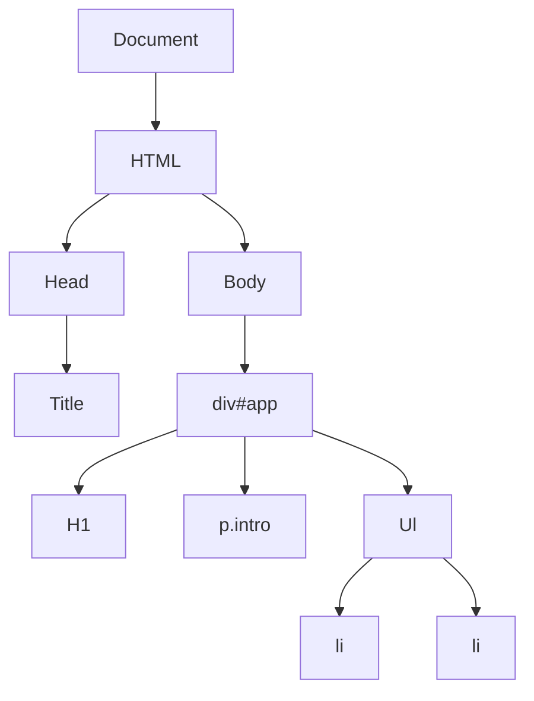
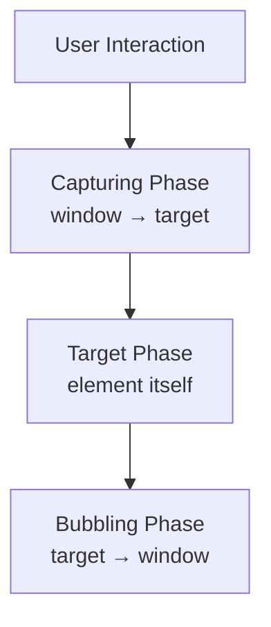
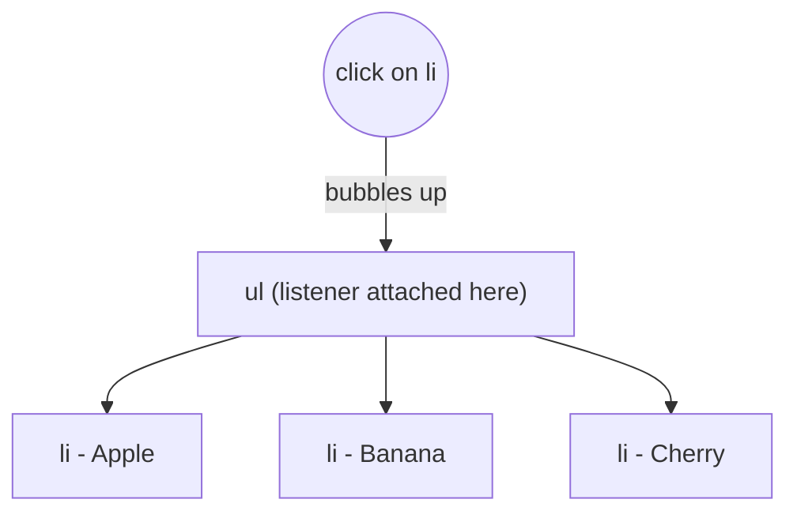
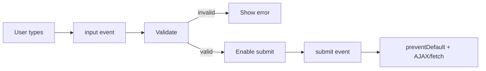
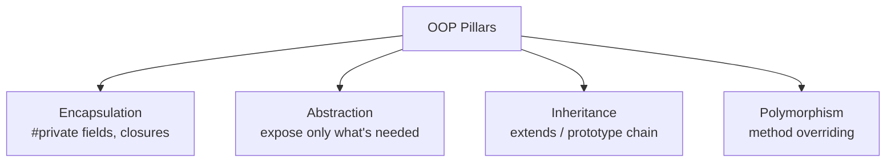
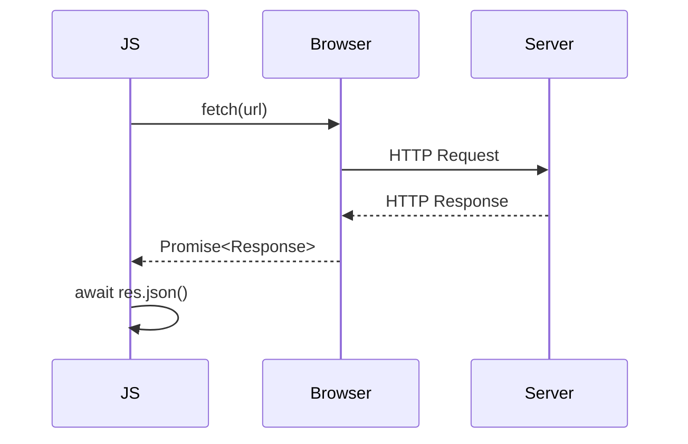
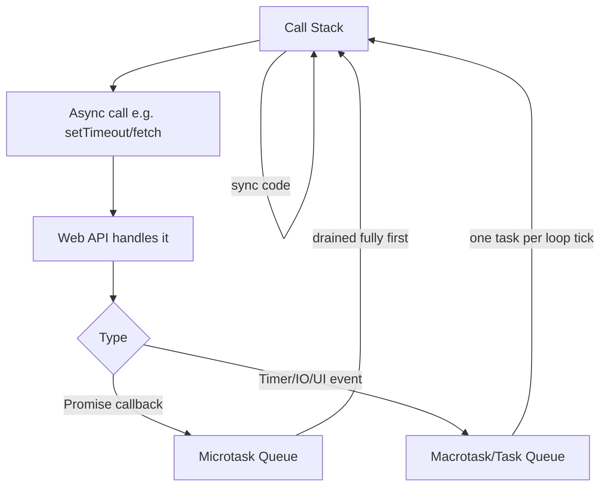
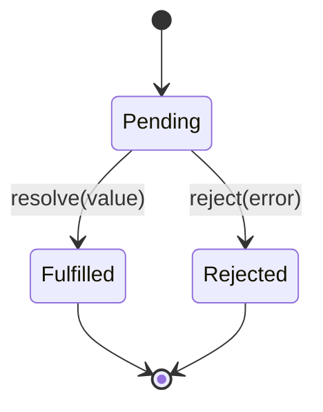
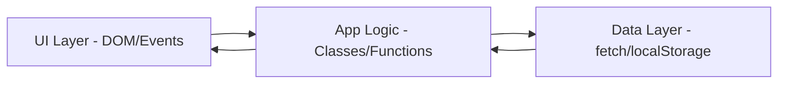

# Volume 2 — Intermediate JavaScript

> Continues from [[Volume 1 - JavaScript Fundamentals]].

## Table of Contents
- [[#1. DOM]]
- [[#2. BOM]]
- [[#3. Events]]
- [[#4. Event Delegation]]
- [[#5. Forms]]
- [[#6. Timers]]
- [[#7. Storage]]
- [[#8. Modules]]
- [[#9. Error Handling]]
- [[#10. Classes]]
- [[#11. OOP]]
- [[#12. Fetch API]]
- [[#13. Async JS]]
- [[#14. Promises]]
- [[#15. Async Await]]
- [[#16. APIs]]
- [[#17. JSON]]
- [[#18. Browser APIs]]
- [[#19. Practical Projects]]

---

## 1. DOM

The **Document Object Model** is a tree representation of an HTML page that JS can read/manipulate.



```javascript
// Selecting
document.getElementById("app");
document.querySelector(".intro");
document.querySelectorAll("li");        // NodeList
document.getElementsByClassName("li");  // live HTMLCollection

// Creating / inserting
const el = document.createElement("div");
el.textContent = "Hi";
el.className = "box";
document.body.appendChild(el);
parent.insertBefore(el, referenceNode);
parent.append(el);          // modern, accepts multiple nodes/strings
parent.prepend(el);
el.remove();

// Reading/writing content
el.innerHTML = "<b>bold</b>";  // parses HTML (XSS risk with user input)
el.textContent = "safe text";  // no parsing

// Attributes & classes
el.setAttribute("data-id", "1");
el.getAttribute("data-id");
el.classList.add("active");
el.classList.remove("active");
el.classList.toggle("active");
el.classList.contains("active");

// Style
el.style.color = "red";

// Traversal
el.parentElement;
el.children;
el.firstElementChild;
el.nextElementSibling;
```

**DOM update cost:** every layout-changing write can trigger reflow/repaint — batch DOM writes, prefer `DocumentFragment` for bulk inserts.

---

## 2. BOM

The **Browser Object Model** exposes browser-level (non-page) objects: `window`, `navigator`, `location`, `history`, `screen`.

```javascript
window.innerWidth; window.innerHeight;
window.alert("hi"); window.confirm("sure?"); window.prompt("name?");

location.href;            // full URL
location.reload();
location.assign("/path");

history.back(); history.forward(); history.pushState({}, "", "/new");

navigator.userAgent;
navigator.onLine;
navigator.geolocation.getCurrentPosition(pos => console.log(pos));

screen.width; screen.height;
```

`window` is the global object in browsers; all global `var`s and functions become properties of it.

---

## 3. Events



```javascript
btn.addEventListener("click", (e) => {
  console.log(e.target);       // element that triggered
  console.log(e.currentTarget);// element listener attached to
  e.preventDefault();          // stop default action (e.g. form submit)
  e.stopPropagation();         // stop bubbling/capturing further
});

// capturing phase (3rd arg true)
el.addEventListener("click", handler, { capture: true, once: true, passive: true });

btn.removeEventListener("click", handler);
```

**Common events:** `click, dblclick, mouseover, mouseout, mousemove, keydown, keyup, keypress, input, change, submit, focus, blur, load, DOMContentLoaded, resize, scroll`.

```javascript
document.addEventListener("DOMContentLoaded", () => {
  // DOM ready, before images/styles finish loading
});
window.addEventListener("load", () => {
  // everything (images, css) fully loaded
});
```

---

## 4. Event Delegation

Instead of attaching listeners to many children, attach **one listener to a common parent** and use `event.target` to identify which child was interacted with. Leverages event bubbling.



```javascript
document.querySelector("ul").addEventListener("click", (e) => {
  if (e.target.tagName === "LI") {
    console.log("Clicked:", e.target.textContent);
  }
});
```

**Benefits:** fewer listeners (memory), works automatically for dynamically-added children, simpler cleanup.

---

## 5. Forms

```javascript
const form = document.querySelector("form");

form.addEventListener("submit", (e) => {
  e.preventDefault();
  const data = new FormData(form);
  const obj = Object.fromEntries(data.entries());
  console.log(obj);
});

// Validation
const input = document.querySelector("#email");
input.checkValidity();       // built-in HTML5 validation
input.setCustomValidity("Enter a valid email");
input.value;
input.addEventListener("input", (e) => console.log(e.target.value));

// Native constraint attributes: required, pattern, min, max, minlength, maxlength
```



---

## 6. Timers

```javascript
const id = setTimeout(() => console.log("once, after 1s"), 1000);
clearTimeout(id);

const intervalId = setInterval(() => console.log("every 2s"), 2000);
clearInterval(intervalId);

// requestAnimationFrame — syncs with browser repaint (~60fps), better for animations
function animate() {
  // update
  requestAnimationFrame(animate);
}
requestAnimationFrame(animate);

// queueMicrotask — runs before next macrotask
queueMicrotask(() => console.log("microtask"));
```

`setTimeout(fn, 0)` doesn't run immediately — it queues `fn` as a macrotask, run only after the call stack empties and all microtasks complete.

---

## 7. Storage

| API | Capacity | Persistence | Sync/Async |
|---|---|---|---|
| `localStorage` | ~5-10MB | Until manually cleared | Sync |
| `sessionStorage` | ~5-10MB | Until tab closes | Sync |
| `cookies` | ~4KB | Configurable expiry, sent with requests | Sync |
| `IndexedDB` | Large (varies) | Persistent | Async (see Vol 5) |

```javascript
localStorage.setItem("theme", "dark");
localStorage.getItem("theme");
localStorage.removeItem("theme");
localStorage.clear();

sessionStorage.setItem("temp", "1");

// Storing objects (must serialize)
localStorage.setItem("user", JSON.stringify({ name: "Riya" }));
const user = JSON.parse(localStorage.getItem("user"));

// Cookies (low-level string API)
document.cookie = "id=123; max-age=3600; path=/";
```

---

## 8. Modules

```javascript
// math.js
export const PI = 3.14159;
export function square(x) { return x * x; }
export default function add(a, b) { return a + b; }

// main.js
import add, { PI, square } from "./math.js";
import * as MathUtils from "./math.js";

// Dynamic import (async, code-splitting)
const module = await import("./math.js");
```

```html
<script type="module" src="main.js"></script>
```

**Module characteristics:** strict mode by default, own scope (no global pollution), singleton (cached after first import), static analysis-friendly (enables tree-shaking).

**CommonJS (Node, older style):**
```javascript
// export
module.exports = { add };
// import
const { add } = require("./math");
```

---

## 9. Error Handling

```javascript
try {
  JSON.parse("{ invalid json");
} catch (err) {
  console.error(err.name, err.message);
} finally {
  console.log("always runs");
}

// Custom errors
class ValidationError extends Error {
  constructor(message) {
    super(message);
    this.name = "ValidationError";
  }
}
throw new ValidationError("Invalid input");

// Async error handling
async function load() {
  try {
    const res = await fetch("/api");
    if (!res.ok) throw new Error(`HTTP ${res.status}`);
  } catch (err) {
    console.error(err);
  }
}

// Global handlers
window.addEventListener("error", (e) => console.log("Uncaught:", e.error));
window.addEventListener("unhandledrejection", (e) => console.log("Unhandled promise:", e.reason));
```

**Built-in error types:** `Error, TypeError, RangeError, ReferenceError, SyntaxError, EvalError, URIError`.

---

## 10. Classes

```javascript
class Vehicle {
  static wheelsDefault = 4;      // static field
  #odometer = 0;                 // private field

  constructor(make, model) {
    this.make = make;
    this.model = model;
  }

  drive(km) {                    // instance method
    this.#odometer += km;
    return this;                 // enables chaining
  }

  get mileage() { return this.#odometer; }   // getter
  set mileage(val) { this.#odometer = val; } // setter

  static create(make, model) {   // static method (factory)
    return new Vehicle(make, model);
  }
}

class Car extends Vehicle {
  constructor(make, model, doors) {
    super(make, model);          // must call before using `this`
    this.doors = doors;
  }
  drive(km) {
    console.log("Car driving...");
    return super.drive(km);      // call parent method
  }
}

const c = new Car("Toyota", "Corolla", 4);
c.drive(100).drive(50);
console.log(c.mileage); // 150
```

Classes are **syntactic sugar** over prototype-based inheritance (see Vol 3 → Prototype Chain).

---

## 11. OOP

**Four pillars in JS:**



```javascript
// Encapsulation
class BankAccount {
  #balance = 0;
  deposit(amt) { this.#balance += amt; }
  get balance() { return this.#balance; }
}

// Polymorphism
class Shape { area() { return 0; } }
class Circle extends Shape { constructor(r){ super(); this.r=r; } area(){ return Math.PI*this.r**2; } }
class Square extends Shape { constructor(s){ super(); this.s=s; } area(){ return this.s**2; } }
[new Circle(2), new Square(3)].forEach(s => console.log(s.area())); // different behavior, same method name
```

**Composition over inheritance (mixins):**
```javascript
const CanFly = (Base) => class extends Base { fly() { return `${this.name} flies`; } };
class Bird {}
class Sparrow extends CanFly(Bird) { constructor(name){ super(); this.name = name; } }
```

---

## 12. Fetch API

```javascript
// GET
const res = await fetch("https://api.example.com/users");
if (!res.ok) throw new Error(`HTTP ${res.status}`);
const data = await res.json();

// POST
const res2 = await fetch("https://api.example.com/users", {
  method: "POST",
  headers: { "Content-Type": "application/json" },
  body: JSON.stringify({ name: "Riya" }),
});

// Abort a fetch
const controller = new AbortController();
fetch(url, { signal: controller.signal });
controller.abort();

// Parallel requests
const [a, b] = await Promise.all([fetch(url1), fetch(url2)]);
```



`fetch` only rejects on **network failure**, not on HTTP error status (404/500) — always check `res.ok`.

---

## 13. Async JS

JS is **single-threaded** but achieves concurrency via the **event loop** offloading async work to Web APIs/libuv.



Order guarantee: **all microtasks run before the next macrotask.**
```javascript
console.log("1");
setTimeout(() => console.log("2 (macrotask)"), 0);
Promise.resolve().then(() => console.log("3 (microtask)"));
console.log("4");
// Output: 1, 4, 3, 2
```

---

## 14. Promises

A `Promise` represents a value that may be available now, later, or never.



```javascript
const promise = new Promise((resolve, reject) => {
  const success = true;
  setTimeout(() => success ? resolve("Done!") : reject("Error!"), 1000);
});

promise
  .then((val) => console.log(val))
  .catch((err) => console.error(err))
  .finally(() => console.log("cleanup"));

// Chaining
fetchUser()
  .then((user) => fetchPosts(user.id))
  .then((posts) => console.log(posts))
  .catch((err) => console.error(err));

// Combinators
Promise.all([p1, p2, p3]);          // rejects fast if any rejects
Promise.allSettled([p1, p2, p3]);   // waits for all, gives status each
Promise.race([p1, p2]);              // settles as soon as one settles
Promise.any([p1, p2]);               // resolves as soon as one fulfills
```

| Combinator | Resolves when | Rejects when |
|---|---|---|
| `all` | all fulfill | any rejects |
| `allSettled` | all settle | never |
| `race` | first settles | first settles (if rejection) |
| `any` | first fulfills | all reject |

---

## 15. Async Await

Syntactic sugar over Promises — makes async code read like sync code.

```javascript
async function getUserPosts(id) {
  try {
    const user = await fetch(`/users/${id}`).then(r => r.json());
    const posts = await fetch(`/users/${id}/posts`).then(r => r.json());
    return posts;
  } catch (err) {
    console.error("Failed:", err);
    throw err;
  }
}

// Parallel awaits (don't await sequentially unless dependent!)
async function loadAll() {
  const [users, posts] = await Promise.all([fetchUsers(), fetchPosts()]);
}

// async functions ALWAYS return a Promise
async function f() { return 1; }
f().then(v => console.log(v)); // 1

// Sequential vs parallel
// ❌ Slow (sequential, ~2s total)
const a = await task1(); const b = await task2();
// ✅ Fast (parallel, ~1s total)
const [a2, b2] = await Promise.all([task1(), task2()]);
```

---

## 16. APIs

**REST API basics:**
```javascript
// GET, POST, PUT, PATCH, DELETE
fetch("/api/users", { method: "GET" });
fetch("/api/users", { method: "POST", body: JSON.stringify(newUser) });
fetch("/api/users/1", { method: "PUT", body: JSON.stringify(updated) });
fetch("/api/users/1", { method: "DELETE" });
```

| Method | Purpose | Idempotent |
|---|---|---|
| GET | Read | Yes |
| POST | Create | No |
| PUT | Replace | Yes |
| PATCH | Partial update | No |
| DELETE | Remove | Yes |

**HTTP status codes:** `200 OK, 201 Created, 204 No Content, 301/302 Redirect, 400 Bad Request, 401 Unauthorized, 403 Forbidden, 404 Not Found, 429 Too Many Requests, 500 Internal Server Error`.

**CORS:** browser security feature — server must send `Access-Control-Allow-Origin` header to permit cross-origin requests.

---

## 17. JSON

**JavaScript Object Notation** — lightweight, text-based data format.

```javascript
const obj = { name: "Riya", age: 28, active: true, tags: ["a", "b"] };

JSON.stringify(obj);              // '{"name":"Riya","age":28,...}'
JSON.stringify(obj, null, 2);     // pretty-printed
JSON.parse('{"name":"Riya"}');    // → object

// stringify replacer/reviver
JSON.stringify(obj, (key, val) => key === "age" ? undefined : val);
JSON.parse(str, (key, val) => key === "date" ? new Date(val) : val);
```

**Rules:** keys must be double-quoted strings, no trailing commas, no comments, no functions/`undefined`/`Symbol` (dropped silently), `Date` becomes an ISO string.

---

## 18. Browser APIs

```javascript
// Geolocation
navigator.geolocation.getCurrentPosition(pos => console.log(pos.coords));

// Clipboard
await navigator.clipboard.writeText("copied!");

// Notification
Notification.requestPermission().then(() => new Notification("Hi!"));

// Intersection Observer (lazy loading, infinite scroll)
const observer = new IntersectionObserver((entries) => {
  entries.forEach(e => { if (e.isIntersecting) loadImage(e.target); });
});
observer.observe(document.querySelector("img.lazy"));

// MutationObserver (watch DOM changes)
const mo = new MutationObserver((mutations) => console.log(mutations));
mo.observe(document.body, { childList: true, subtree: true });

// History API
history.pushState({ page: 1 }, "", "/page1");
window.addEventListener("popstate", (e) => console.log(e.state));

// Canvas
const ctx = canvas.getContext("2d");
ctx.fillRect(0, 0, 100, 100);
```

---

## 19. Practical Projects

1. **To-Do App with DOM** — render list from array, delegate click for delete/toggle, persist to `localStorage`.
2. **Weather App** — fetch API to a public weather endpoint, render results, handle loading/error states.
3. **Form Validator** — real-time validation feedback using events + regex.
4. **Image Carousel** — timers + DOM manipulation + event listeners for prev/next/dots.
5. **Infinite Scroll Feed** — `IntersectionObserver` + `fetch` pagination.
6. **Quiz App** — classes for `Question`/`Quiz`, async loading of question sets (JSON), score via OOP.
7. **Notes App with IndexedDB-lite (localStorage)** — CRUD notes, modules split across files (`storage.js`, `ui.js`, `main.js`).
8. **GitHub User Search** — fetch GitHub public API, debounce input, error handling for 404 users.



> Next: **Volume 3 — Advanced JavaScript** (Execution Context, Event Loop internals, Prototypes, Generators, Proxy/Reflect).
