# Volume 3 — Advanced JavaScript

> Continues from [[Volume 2 - Intermediate JavaScript]].

## Table of Contents
- [[#1. Execution Context]]
- [[#2. Call Stack]]
- [[#3. Event Loop]]
- [[#4. Memory Management]]
- [[#5. Garbage Collection]]
- [[#6. Prototype Chain]]
- [[#7. This Keyword]]
- [[#8. Bind Call Apply]]
- [[#9. Functional Programming]]
- [[#10. Recursion]]
- [[#11. Generators]]
- [[#12. Iterators]]
- [[#13. Symbols]]
- [[#14. Maps]]
- [[#15. Sets]]
- [[#16. WeakMaps]]
- [[#17. WeakSets]]
- [[#18. Proxy]]
- [[#19. Reflect]]
- [[#20. Performance]]
- [[#21. Security]]
- [[#22. Design Patterns]]

---

## 1. Execution Context

Every time code runs, JS creates an **Execution Context (EC)**: Global EC (one, created at start) or Function EC (one per call).

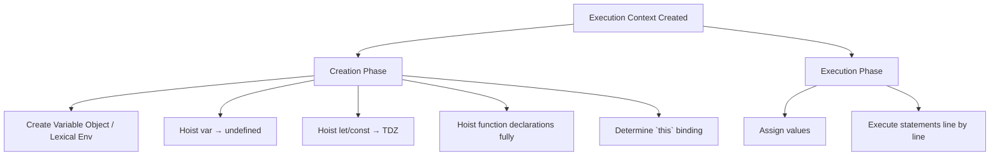

Each EC has: **Variable Environment**, **Lexical Environment** (with reference to outer scope — enables closures), and **`this` binding**.

---

## 2. Call Stack

LIFO structure tracking function calls.

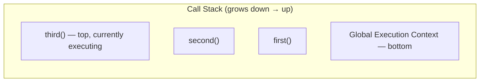

```javascript
function first() { second(); }
function second() { third(); }
function third() { console.log("here"); }
first();
// Stack: [global] → [global, first] → [global, first, second] → [global, first, second, third] → unwinds back
```

**Stack overflow:** uncontrolled recursion exceeds stack size limit → `RangeError: Maximum call stack size exceeded`.

---

## 3. Event Loop

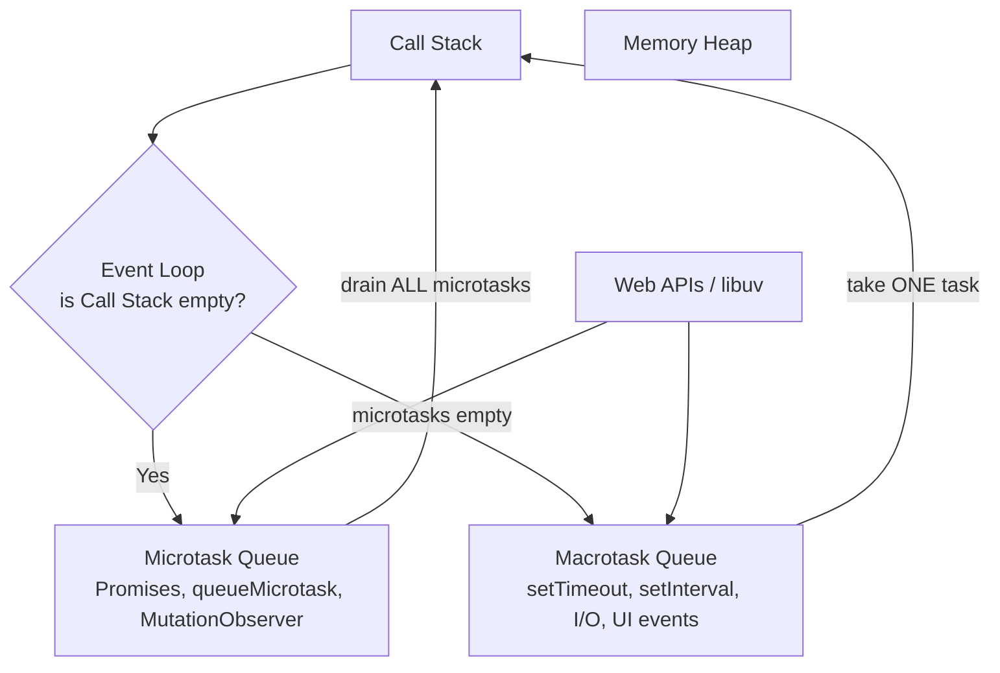

**Node.js event loop phases** (libuv): `timers → pending callbacks → idle/prepare → poll → check (setImmediate) → close callbacks`, with `process.nextTick` and microtasks draining between every phase.

```javascript
console.log("start");
setTimeout(() => console.log("timeout"), 0);
Promise.resolve().then(() => console.log("promise1")).then(() => console.log("promise2"));
console.log("end");
// start, end, promise1, promise2, timeout
```

---

## 4. Memory Management

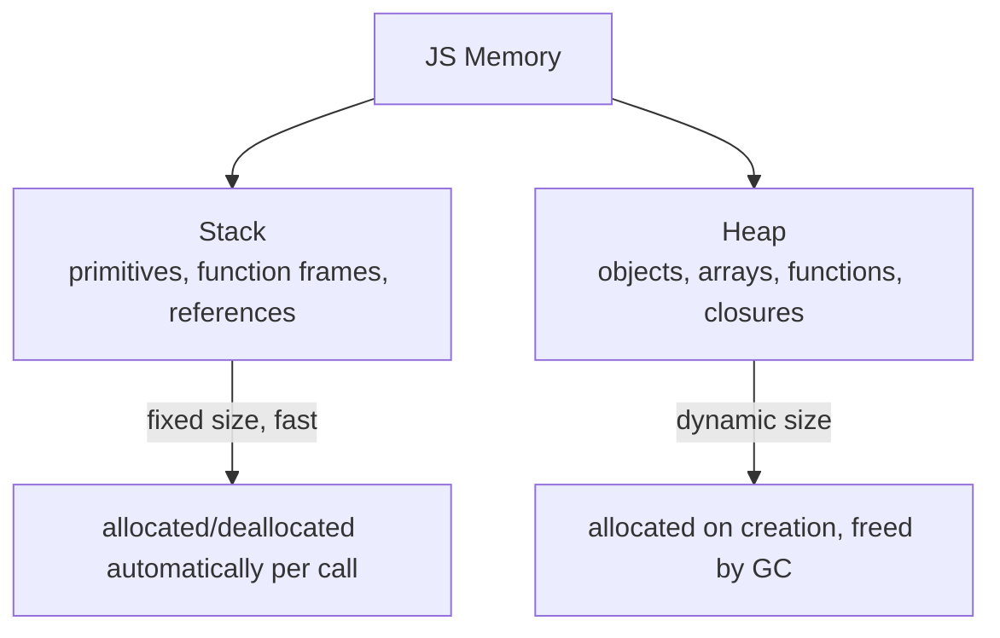

**Lifecycle:** allocate memory → use (read/write) → release when no longer needed.

**Common leaks:**
```javascript
// 1. Forgotten timers/listeners
setInterval(() => useData(largeObj), 1000); // never cleared

// 2. Detached DOM nodes kept in JS references
let cache = document.getElementById("el");
el.remove(); // still referenced by `cache` → leak

// 3. Accidental globals
function leak() { globalVar = "oops"; } // no var/let/const

// 4. Closures holding large data unnecessarily
function outer() {
  const bigData = new Array(1e6).fill("*");
  return () => console.log("hi"); // closure keeps bigData alive if referenced
}
```

---

## 5. Garbage Collection

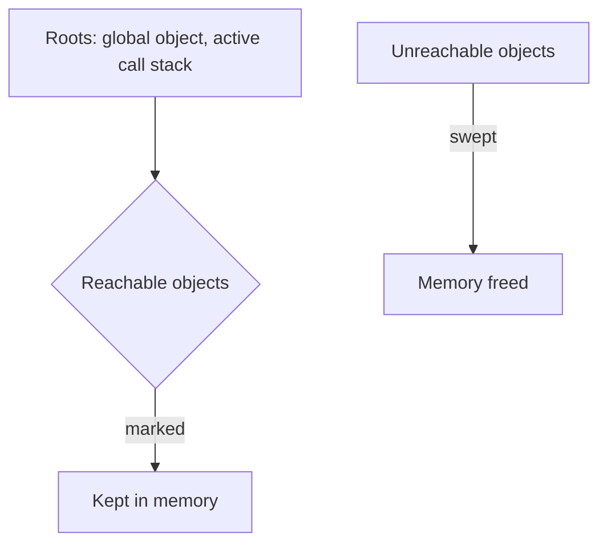

**Mark-and-Sweep algorithm** (used by V8): starting from roots (global, call stack), mark all reachable objects; anything unmarked is garbage, gets swept.

**V8 Generational GC:**
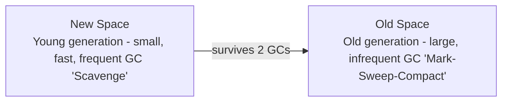

- Reference counting was the old approach — fails on **circular references** (two objects referencing each other, unreachable from root, but count > 0). Modern engines use mark-and-sweep, which handles cycles correctly.
- Developers **cannot force GC**; can only avoid holding unnecessary references (`null` out large vars, remove listeners, use `WeakMap`/`WeakSet` for caches).

---

## 6. Prototype Chain

Every JS object has an internal `[[Prototype]]` link (`__proto__`) to another object, forming a chain used for property lookup.

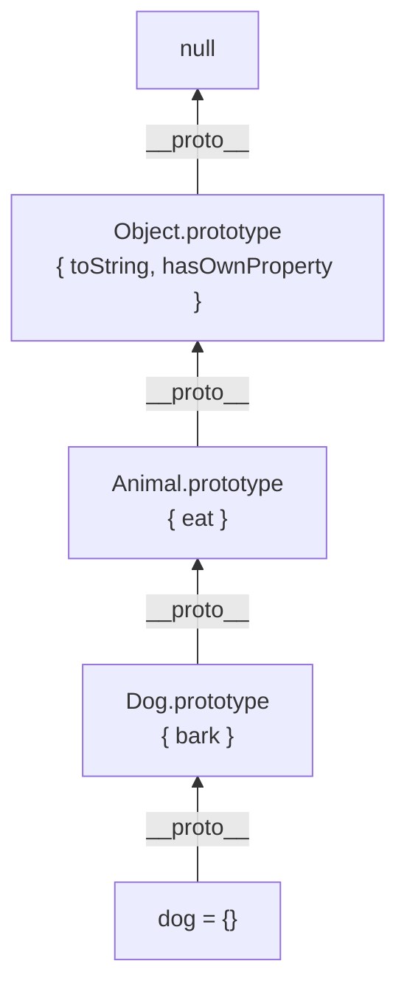

```javascript
function Animal(name) { this.name = name; }
Animal.prototype.eat = function () { return `${this.name} eats`; };

function Dog(name) { Animal.call(this, name); }
Dog.prototype = Object.create(Animal.prototype);
Dog.prototype.constructor = Dog;
Dog.prototype.bark = function () { return `${this.name} barks`; };

const d = new Dog("Rex");
d.bark();  // own prototype
d.eat();   // found up the chain
d.hasOwnProperty("name"); // true (own property)
d.hasOwnProperty("eat");  // false (inherited)

// Modern classes = sugar over the same mechanism
class Animal2 { eat() {} }
class Dog2 extends Animal2 { bark() {} }
Object.getPrototypeOf(new Dog2()) === Dog2.prototype; // true
```

Lookup: engine checks own properties first, then walks `__proto__` chain until found or reaches `null`.

---

## 7. This Keyword

`this` value is determined by **how a function is called**, not where it's defined (except arrow functions).

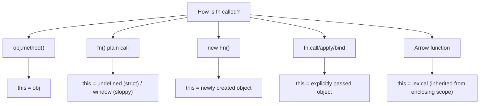

```javascript
const obj = {
  name: "A",
  regular() { return this.name; },
  arrow: () => this?.name, // lexical `this` — NOT obj, likely undefined
};
obj.regular(); // "A"
obj.arrow();   // undefined

const fn = obj.regular;
fn(); // undefined — lost binding! (this = undefined in strict mode)

class Btn {
  constructor() { this.label = "Click"; }
  handleClick = () => console.log(this.label); // arrow class field — auto-bound
}
```

---

## 8. Bind Call Apply

Explicitly set `this` for a function call.

```javascript
const person = { name: "Riya" };
function greet(greeting, punctuation) {
  return `${greeting}, ${this.name}${punctuation}`;
}

greet.call(person, "Hi", "!");       // invokes immediately, args listed individually
greet.apply(person, ["Hi", "!"]);    // invokes immediately, args as array
const bound = greet.bind(person, "Hi"); // returns NEW function, not invoked yet
bound("!");                          // "Hi, Riya!"
```

| Method | Invokes Immediately | Args Format |
|---|---|---|
| `call` | Yes | comma-separated |
| `apply` | Yes | array |
| `bind` | No (returns fn) | comma-separated (can partially apply) |

**Use case — borrowing methods:**
```javascript
function sum() { return [...arguments].reduce((a,b) => a+b); }
sum.apply(null, [1, 2, 3]); // 6
Math.max.apply(null, [1, 5, 3]); // 5 (pre-spread-operator trick)
```

---

## 9. Functional Programming

Core principles: **pure functions**, **immutability**, **first-class/higher-order functions**, **no side effects**, **composition**.

```javascript
// Pure function: same input → same output, no side effects
const add = (a, b) => a + b;

// Impure (side effect)
let total = 0;
function addToTotal(x) { total += x; } // mutates external state

// Immutability
const arr = [1, 2, 3];
const newArr = [...arr, 4];     // don't mutate original
const obj2 = { ...obj, x: 1 };

// Function composition
const compose = (...fns) => (x) => fns.reduceRight((acc, fn) => fn(acc), x);
const pipe = (...fns) => (x) => fns.reduce((acc, fn) => fn(acc), x);
const double = x => x * 2;
const inc = x => x + 1;
pipe(double, inc)(5); // (5*2)+1 = 11

// Currying
const curry = (fn) => (...args) =>
  args.length >= fn.length ? fn(...args) : (...more) => curry(fn)(...args, ...more);
const add3 = curry((a, b, c) => a + b + c);
add3(1)(2)(3); // 6

// map/filter/reduce as FP building blocks
[1,2,3].map(x => x * 2).filter(x => x > 2).reduce((a,b) => a+b);
```

---

## 10. Recursion

A function that calls itself, with a **base case** to stop.

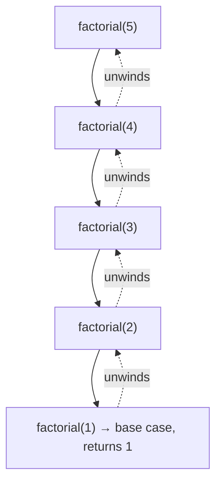

```javascript
function factorial(n) {
  if (n <= 1) return 1;      // base case
  return n * factorial(n - 1); // recursive case
}

// Tail call (optimizable in theory, not in most JS engines currently)
function factorialTail(n, acc = 1) {
  if (n <= 1) return acc;
  return factorialTail(n - 1, n * acc);
}

// Recursion vs iteration for traversal (e.g. nested objects/DOM)
function flatten(arr) {
  return arr.reduce((flat, item) =>
    flat.concat(Array.isArray(item) ? flatten(item) : item), []);
}
```

**Tradeoff:** recursion is often more readable for tree/graph problems but risks stack overflow on deep input; iteration avoids that but can be more verbose.

---

## 11. Generators

Functions that can **pause and resume**, producing a sequence of values lazily.

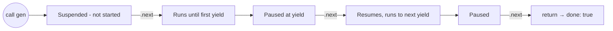

```javascript
function* idGenerator() {
  let id = 1;
  while (true) {
    yield id++;
  }
}
const gen = idGenerator();
gen.next(); // { value: 1, done: false }
gen.next(); // { value: 2, done: false }

function* range(start, end) {
  for (let i = start; i <= end; i++) yield i;
}
[...range(1, 5)]; // [1,2,3,4,5] — generators are iterable

// Two-way communication
function* echo() {
  const x = yield "ready?";
  console.log("received:", x);
}
const it = echo();
it.next();        // { value: "ready?", done: false }
it.next("yes!");  // logs "received: yes!"

// Async generators (see Vol 5)
async function* asyncGen() { yield await fetchSomething(); }
```

---

## 12. Iterators

The **iterator protocol**: an object with a `.next()` method returning `{ value, done }`. The **iterable protocol**: an object with `[Symbol.iterator]` returning an iterator.

```javascript
function makeIterator(arr) {
  let i = 0;
  return {
    next: () => i < arr.length
      ? { value: arr[i++], done: false }
      : { value: undefined, done: true },
  };
}

// Custom iterable
const range = {
  from: 1, to: 5,
  [Symbol.iterator]() {
    let current = this.from, last = this.to;
    return {
      next() {
        return current <= last
          ? { value: current++, done: false }
          : { done: true };
      },
    };
  },
};
[...range];           // [1,2,3,4,5]
for (const n of range) console.log(n);
```

**Built-in iterables:** `Array, String, Map, Set, NodeList, arguments`. Powers `for...of`, spread `...`, `Array.from`, destructuring.

---

## 13. Symbols

A primitive type representing a **guaranteed-unique identifier**, often used as object keys to avoid name collisions.

```javascript
const sym1 = Symbol("id");
const sym2 = Symbol("id");
sym1 === sym2; // false — always unique

const user = {
  name: "Riya",
  [sym1]: "hidden-value", // not enumerable in for...in / JSON.stringify
};
Object.keys(user);         // ["name"] — symbols excluded
JSON.stringify(user);       // '{"name":"Riya"}' — symbols excluded

// Well-known symbols customize built-in behavior
class Range {
  constructor(a, b) { this.a = a; this.b = b; }
  [Symbol.iterator]() { /* ... */ }
}
class Money {
  [Symbol.toPrimitive](hint) {
    if (hint === "number") return 100;
    return "$100";
  }
}

// Global symbol registry (shared across realms)
const s1 = Symbol.for("app.id");
const s2 = Symbol.for("app.id");
s1 === s2; // true
```

---

## 14. Maps

`Map` = key-value store where **keys can be any type** (unlike plain objects, which coerce keys to strings).

```javascript
const map = new Map();
map.set("name", "Riya");
map.set(42, "number key");
map.set({}, "object key");

map.get("name");     // "Riya"
map.has("name");     // true
map.delete("name");
map.size;

for (const [key, val] of map) console.log(key, val);
[...map.keys()]; [...map.values()]; [...map.entries()];

// Map vs Object
```

| Feature | `Map` | `Object` |
|---|---|---|
| Key types | Any | String/Symbol only |
| Order | Insertion order guaranteed | Mostly, with quirks for numeric keys |
| Size | `.size` | `Object.keys(obj).length` |
| Iterable | Yes, directly | No (need `Object.entries`) |
| Performance | Better for frequent add/remove | Better for static shape |

---

## 15. Sets

Collection of **unique values** of any type.

```javascript
const set = new Set([1, 2, 2, 3]); // {1, 2, 3}
set.add(4);
set.has(2);       // true
set.delete(1);
set.size;
[...set];          // convert to array

// Common use: dedupe array
const unique = [...new Set([1, 1, 2, 3, 3])]; // [1,2,3]

// Set operations (manual, no native union/intersection pre-ES2024)
const a = new Set([1,2,3]), b = new Set([2,3,4]);
const union = new Set([...a, ...b]);
const intersection = new Set([...a].filter(x => b.has(x)));
const difference = new Set([...a].filter(x => !b.has(x)));

// ES2024 native set methods
a.union(b); a.intersection(b); a.difference(b);
```

---

## 16. WeakMaps

Like `Map`, but keys **must be objects** and are held **weakly** — doesn't prevent garbage collection.

```javascript
let obj = { id: 1 };
const wm = new WeakMap();
wm.set(obj, "metadata");
wm.get(obj); // "metadata"

obj = null; // original object now eligible for GC — WeakMap entry auto-removed
```

**Not iterable, no `.size`, no `.keys()`** — by design, since entries can disappear unpredictably. Common use: private data storage per-object, caching without leaking memory.

---

## 17. WeakSets

Like `Set`, but stores **only objects**, held weakly.

```javascript
const ws = new WeakSet();
let user = { name: "Riya" };
ws.add(user);
ws.has(user); // true
user = null;   // GC-eligible, auto-removed from WeakSet
```

**Use case:** tracking which objects have been "seen"/"processed" without preventing their cleanup (e.g., marking DOM nodes as initialized).

---

## 18. Proxy

Wraps an object to **intercept and customize fundamental operations** (get, set, delete, etc.) via "traps".

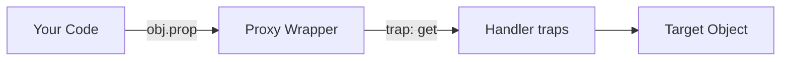

```javascript
const target = { name: "Riya", age: 28 };
const handler = {
  get(obj, prop) {
    console.log(`Reading ${prop}`);
    return prop in obj ? obj[prop] : `${prop} not found`;
  },
  set(obj, prop, value) {
    if (prop === "age" && typeof value !== "number") {
      throw new TypeError("age must be a number");
    }
    obj[prop] = value;
    return true;
  },
  deleteProperty(obj, prop) {
    console.log(`Deleting ${prop}`);
    delete obj[prop];
    return true;
  },
};
const proxy = new Proxy(target, handler);
proxy.name;         // logs "Reading name" → "Riya"
proxy.missing;       // "missing not found"
proxy.age = "old";  // throws TypeError

// Common traps: get, set, has, deleteProperty, apply, construct, ownKeys
```

**Real-world uses:** validation, reactive frameworks (Vue 3 reactivity), logging/auditing, virtualized/computed properties, API mocking.

---

## 19. Reflect

Built-in object providing **methods mirroring the internal operations** Proxy traps intercept — a cleaner API than manual object manipulation.

```javascript
const obj = { name: "Riya" };

Reflect.get(obj, "name");           // "Riya"
Reflect.set(obj, "age", 28);
Reflect.has(obj, "name");           // "name" in obj
Reflect.deleteProperty(obj, "age");
Reflect.ownKeys(obj);                // like Object.keys + symbols
Reflect.defineProperty(obj, "x", { value: 1 });

// Typically paired with Proxy — forward default behavior after custom logic
const handler = {
  get(target, prop, receiver) {
    console.log("accessed", prop);
    return Reflect.get(target, prop, receiver); // default behavior, correct `this`
  },
};
```

Using `Reflect.*` inside Proxy traps (instead of `target[prop]`) correctly preserves `this`/receiver semantics, especially with inheritance and getters.

---

## 20. Performance

```mermaid
graph TD
    Perf[Performance Optimization] --> Algo[Algorithmic<br/>avoid O(n²), memoize]
    Perf --> DOM[DOM<br/>batch reads/writes, avoid layout thrashing]
    Perf --> Mem[Memory<br/>avoid leaks, reuse objects]
    Perf --> Load[Loading<br/>lazy load, code split, defer/async scripts]
    Perf --> Render[Rendering<br/>debounce/throttle, requestAnimationFrame]
```

```javascript
// Memoization
function memoize(fn) {
  const cache = new Map();
  return (...args) => {
    const key = JSON.stringify(args);
    if (cache.has(key)) return cache.get(key);
    const result = fn(...args);
    cache.set(key, result);
    return result;
  };
}

// Avoid layout thrashing (read then write, not interleaved)
// ❌ Bad
els.forEach(el => { el.style.width = el.offsetWidth + 10 + "px"; }); // read+write interleaved per el
// ✅ Good
const widths = els.map(el => el.offsetWidth);      // batch reads
els.forEach((el, i) => el.style.width = widths[i] + 10 + "px"); // batch writes

// Debounce vs throttle
// debounce: run once after inactivity (e.g. search input)
// throttle: run at most once per interval (e.g. scroll handler)
```

**Tools:** Chrome DevTools Performance tab, Lighthouse, `performance.now()`, `performance.mark/measure`.

---

## 21. Security

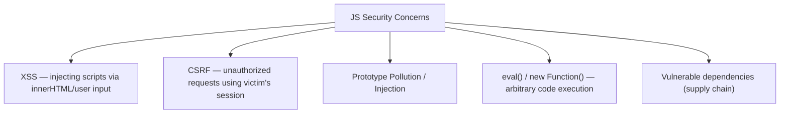

```javascript
// XSS prevention
el.textContent = userInput;              // ✅ safe — no HTML parsing
el.innerHTML = userInput;                 // ❌ danger, sanitize first (e.g. DOMPurify)

// Avoid eval / new Function with untrusted input
eval(userInput);                          // ❌ never do this

// Prototype pollution guard
JSON.parse(str, (k, v) => k === "__proto__" ? undefined : v);
Object.create(null);                       // object with no prototype, immune to pollution via inherited keys

// CSP header (server-side) restricts allowed script sources
// Content-Security-Policy: script-src 'self'

// Sensitive data
// Never store secrets/API keys in client-side JS — visible to anyone.
```

**Best practices:** sanitize/escape all user input before rendering, use HTTPS, set `SameSite`/`HttpOnly` cookies, validate on server (never trust client), keep dependencies patched (`npm audit`).

---

## 22. Design Patterns

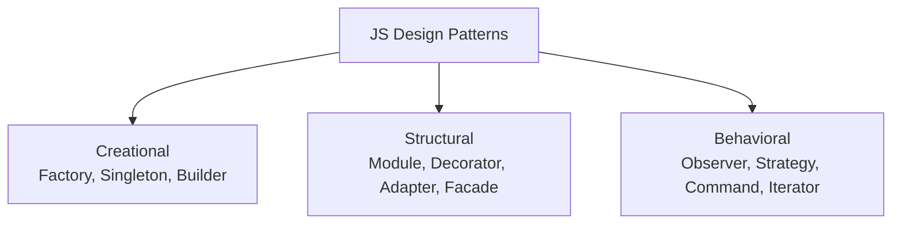

```javascript
// Singleton
class Database {
  static #instance;
  static getInstance() {
    if (!Database.#instance) Database.#instance = new Database();
    return Database.#instance;
  }
}

// Factory
function createUser(type) {
  if (type === "admin") return { role: "admin", access: "all" };
  return { role: "user", access: "limited" };
}

// Module pattern (via closures/IIFE)
const CounterModule = (function () {
  let count = 0;
  return { increment: () => ++count, get: () => count };
})();

// Observer (pub-sub)
class EventBus {
  #listeners = {};
  on(event, cb) { (this.#listeners[event] ??= []).push(cb); }
  emit(event, data) { (this.#listeners[event] || []).forEach(cb => cb(data)); }
}

// Strategy
const strategies = {
  add: (a, b) => a + b,
  sub: (a, b) => a - b,
};
function calculate(strategy, a, b) { return strategies[strategy](a, b); }

// Decorator
function withLogging(fn) {
  return (...args) => { console.log("calling with", args); return fn(...args); };
}

// Facade
class Api {
  #http = new HttpClient();
  getUser(id) { return this.#http.get(`/users/${id}`); } // hides complexity
}
```

> Next: **Volume 4 — Professional JavaScript** (Clean Code, SOLID, Testing, Build Tools, Git).
