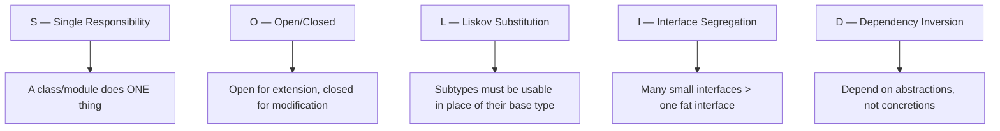
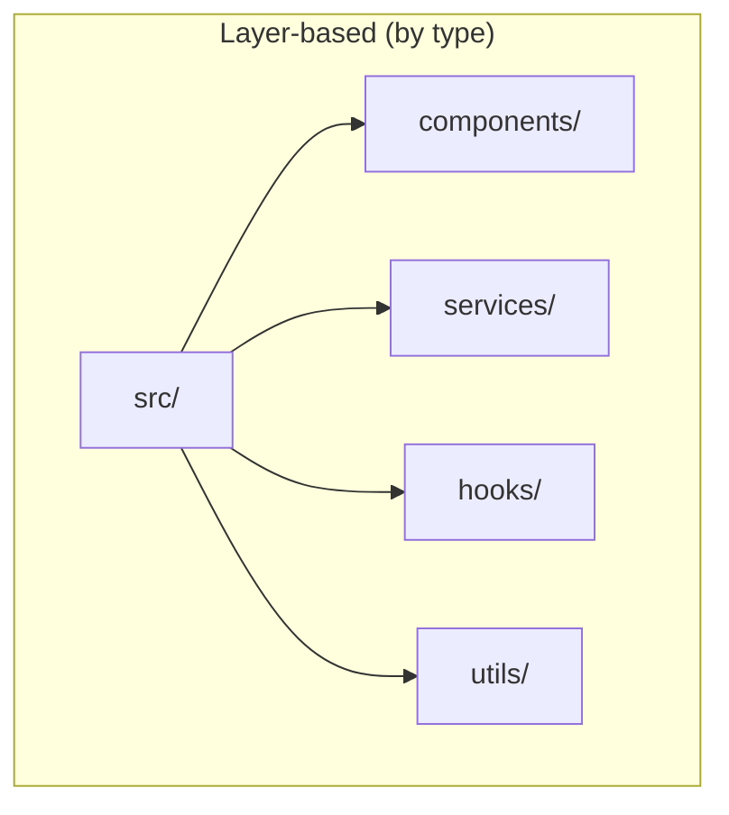
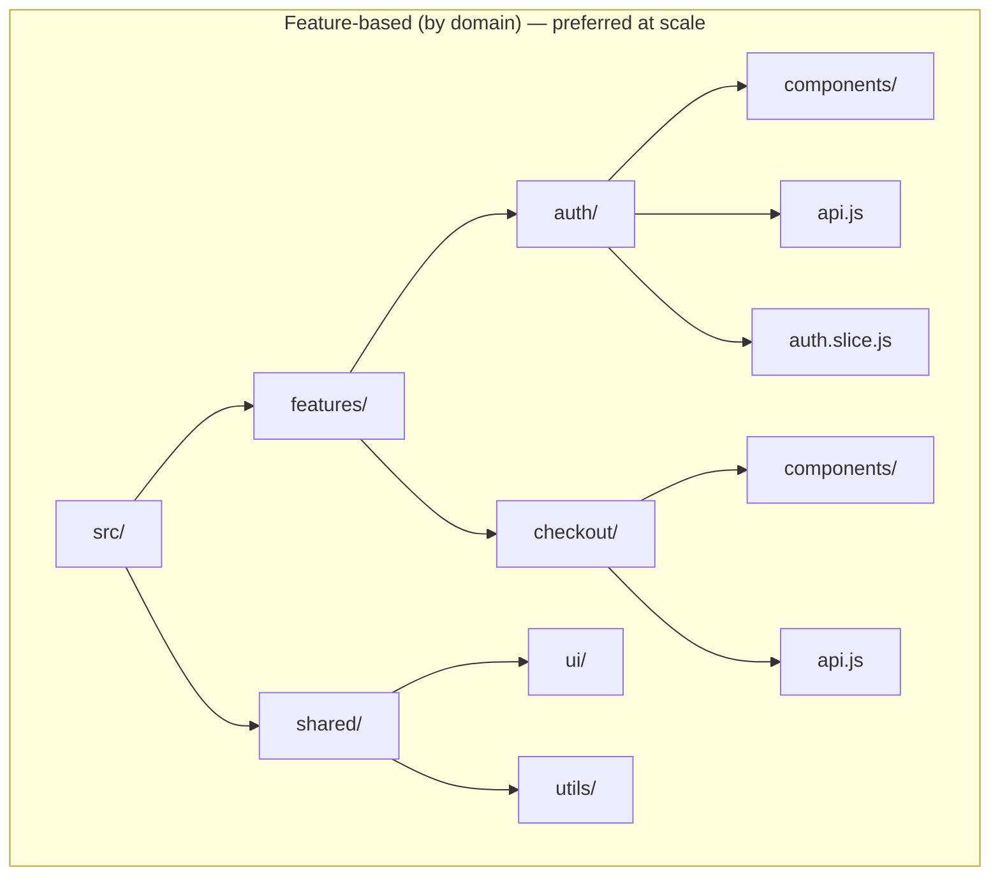
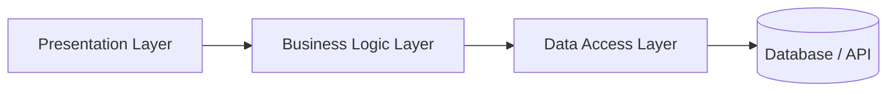
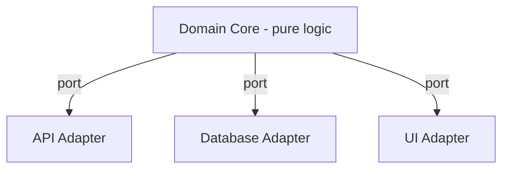
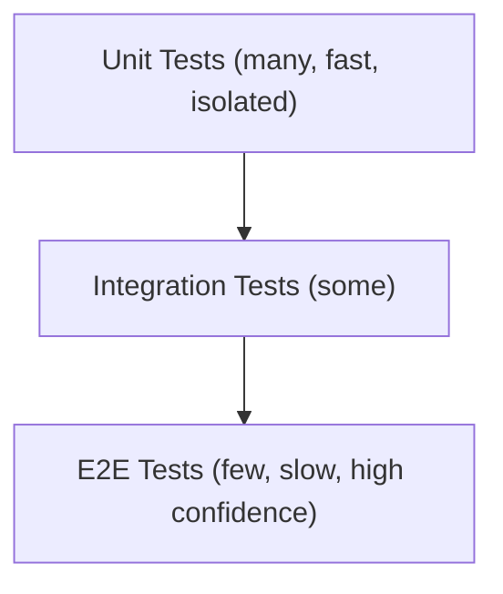
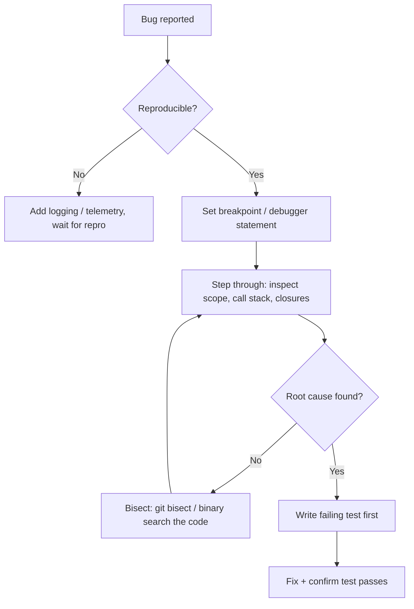
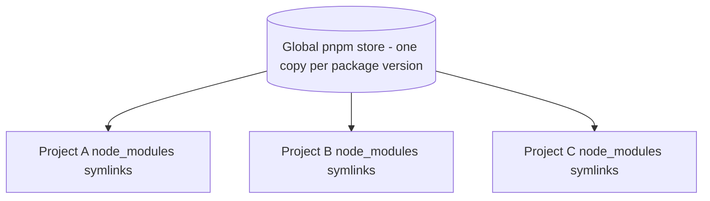
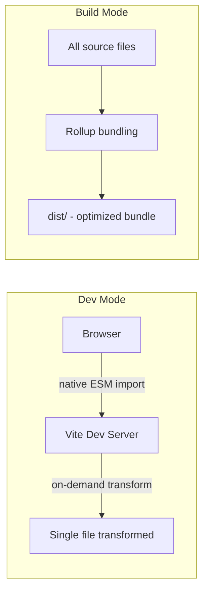
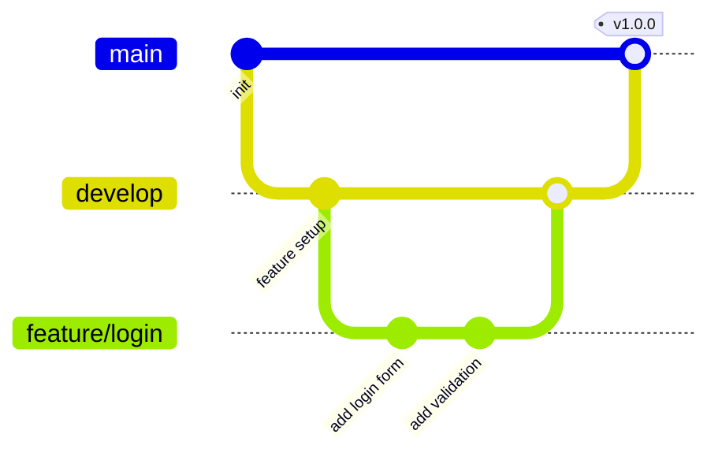

# 📗 JavaScript — Volume 4: Professional JavaScript

> Volume 3 covered the language and the engine. Volume 4 covers how professionals *build, structure, test, and ship* JavaScript.

## 🧭 Map of this note


---

## 1. Clean Code

Core rules that scale across teams:

- **Meaningful names** — `getUserById`, not `getData`.
- **Small functions** — one function, one responsibility, ideally < 20 lines.
- **Avoid deep nesting** — prefer early returns (*guard clauses*).
- **No magic numbers/strings** — extract to named constants.
- **Comments explain "why", not "what"** — code should already say "what".

```js
// ❌ Unclear, deeply nested
function process(user) {
  if (user) {
    if (user.active) {
      if (user.age >= 18) {
        return "eligible";
      }
    }
  }
  return "not eligible";
}

// ✅ Guard clauses, flat, readable
function process(user) {
  if (!user) return "not eligible";
  if (!user.active) return "not eligible";
  if (user.age < 18) return "not eligible";
  return "eligible";
}
```

## 2. SOLID Principles



```js
// Open/Closed example: extend via new classes, not by editing existing ones
class Discount {
  apply(price) { return price; }
}
class BlackFridayDiscount extends Discount {
  apply(price) { return price * 0.5; }
}
class NewYearDiscount extends Discount {
  apply(price) { return price * 0.7; }
}

function checkout(price, discount) {
  return discount.apply(price); // never modified when adding new discount types
}
```

## 3. DRY (Don't Repeat Yourself)

Duplication is fine **once**. The 2nd or 3rd repetition is the signal to extract a function/module. Over-applying DRY too early leads to premature, wrong abstractions — a bigger sin than mild duplication.

```js
// Repeated validation logic → extract
function validateEmail(email) {
  return /\S+@\S+\.\S+/.test(email);
}
// Reuse everywhere instead of re-writing the regex
```

## 4. KISS (Keep It Simple, Stupid)

Prefer the boring, obvious solution over the clever one. A clever one-liner that the next engineer can't parse in 5 seconds is a liability, not a flex.

```js
// ❌ Clever but opaque
const isEven = n => !(n & 1);

// ✅ Simple, obvious
const isEven = n => n % 2 === 0;
```

## 5. Enterprise Folder Structure

Two dominant strategies:





Feature-based structure keeps everything related to one domain colocated — easier to delete, easier to onboard, easier to reason about ownership.

## 6. Architecture

Common application-layer architectures:



- **Layered architecture** — separation shown above; each layer only talks to the one below it.
- **MVC** — Model (data), View (UI), Controller (orchestration).
- **Hexagonal / Ports & Adapters** — core domain logic isolated from frameworks and I/O; frameworks are "adapters" plugged into "ports".



## 7. Testing


The **Testing Pyramid**: most tests should be unit tests (fast, cheap), fewer integration tests, and a handful of E2E tests covering critical user flows.

```js
// A simple unit test (framework-agnostic pseudocode)
function add(a, b) { return a + b; }

test("adds two numbers", () => {
  expect(add(2, 3)).toBe(5);
});
```

## 8. Jest

```js
// sum.test.js
import { sum } from "./sum";

describe("sum()", () => {
  it("adds positive numbers", () => {
    expect(sum(1, 2)).toBe(3);
  });

  it("handles mocks", () => {
    const mockFn = jest.fn(() => 42);
    expect(mockFn()).toBe(42);
    expect(mockFn).toHaveBeenCalledTimes(1);
  });
});
```
Key Jest features: snapshot testing, built-in mocking (`jest.fn`, `jest.mock`), coverage reports (`jest --coverage`), and `jsdom` for DOM simulation.

## 9. Vitest

Vite-native test runner — Jest-compatible API, much faster (uses esbuild/Vite's transform pipeline, native ESM, HMR for tests).

```js
import { describe, it, expect, vi } from "vitest";

describe("sum", () => {
  it("works", () => {
    expect(1 + 1).toBe(2);
  });
});
```

| | Jest | Vitest |
|---|---|---|
| Speed | Slower (Babel transform) | Faster (esbuild/Vite) |
| Config | Standalone | Shares Vite config |
| ESM | Partial | Native |
| Ecosystem | Larger, older | Growing, modern |

## 10. Debugging



```js
function calculate(x) {
  debugger; // pauses execution here when DevTools is open
  return x * 2;
}
```
Chrome DevTools essentials: **Sources panel** breakpoints, **conditional breakpoints**, **watch expressions**, **call stack panel**, **Network tab** for request timing, **Performance tab** for flame graphs.

## 11. Performance Optimization (Professional Context)

- Bundle-size budgets enforced in CI (e.g. `bundlesize`, `size-limit`).
- Code-splitting via dynamic `import()`.
- Memoization (`useMemo`, `React.memo`, or manual caching) to avoid redundant recomputation.
- Lazy-loading images/routes.

```js
// Dynamic import → separate chunk, loaded on demand
button.addEventListener("click", async () => {
  const { heavyModule } = await import("./heavyModule.js");
  heavyModule.run();
});
```

## 12. Security Best Practices

- Never trust client input — validate/sanitize on the server too.
- Use `Content-Security-Policy` headers to mitigate XSS.
- Keep dependencies patched (`npm audit`, Dependabot/Renovate).
- Store secrets in environment variables, never in source control.
- Use parameterized queries — never string-concatenate SQL.

## 13. Build Tools — Overview


## 14. npm

```bash
npm init -y                 # scaffold package.json
npm install lodash          # add dependency
npm install -D eslint       # add dev dependency
npm run build                # run a script from package.json
npm ci                       # clean install from package-lock.json (CI-safe)
```
Uses a flat `node_modules` (since npm v3+) and `package-lock.json` for reproducible installs.

## 15. pnpm

Uses a **content-addressable store** — packages are stored once globally and *hard-linked* into projects, saving huge amounts of disk space and install time.

```bash
pnpm install
pnpm add axios
pnpm run dev
```


Strict by default — a package can only import dependencies it explicitly declared (prevents "phantom dependency" bugs common in npm/yarn flat trees).

## 16. Bun

An all-in-one JS runtime + package manager + bundler + test runner, written in Zig, built on JavaScriptCore (not V8).

```bash
bun install        # extremely fast installs
bun run index.ts   # runs TS/JS directly, no separate compile step
bun test           # built-in test runner, Jest-compatible API
bun build ./index.ts --outdir ./dist
```

## 17. Vite

Dev server uses **native ES modules** — no bundling in development, so startup is near-instant regardless of app size. Production builds use Rollup under the hood.



```js
// vite.config.js
import { defineConfig } from "vite";
export default defineConfig({
  server: { port: 3000 },
  build: { outDir: "dist" }
});
```

## 18. Webpack

Older, highly configurable bundler. Everything is a module via **loaders**; behavior extended via **plugins**.

```js
// webpack.config.js
module.exports = {
  entry: "./src/index.js",
  output: { filename: "bundle.js", path: __dirname + "/dist" },
  module: {
    rules: [
      { test: /\.css$/, use: ["style-loader", "css-loader"] },
      { test: /\.js$/, exclude: /node_modules/, use: "babel-loader" }
    ]
  }
};
```


## 19. Babel

Transpiles modern JS syntax down to older, more widely-supported JS (e.g. optional chaining → conditional checks for old browsers).

```json
// babel.config.json
{
  "presets": ["@babel/preset-env", "@babel/preset-react"]
}
```
`preset-env` reads a `browserslist` target and only includes the transforms actually needed — avoids unnecessary bloat.

## 20. ESLint

Static analysis for code quality/style problems *before* runtime.

```json
// .eslintrc.json
{
  "extends": ["eslint:recommended"],
  "rules": {
    "no-unused-vars": "warn",
    "eqeqeq": "error"
  }
}
```
```bash
eslint . --fix   # auto-fix what it safely can
```

## 21. Prettier

Opinionated code *formatter* (not a linter) — removes all debate about spacing, quotes, semicolons. Commonly paired with ESLint (`eslint-config-prettier` disables ESLint's own formatting rules to avoid conflicts).

```json
// .prettierrc
{ "semi": true, "singleQuote": true, "printWidth": 80 }
```

## 22. Git Workflow



Common flows:
- **Git Flow** — `main` (production) + `develop` (integration) + `feature/*`, `release/*`, `hotfix/*` branches.
- **Trunk-Based Development** — everyone merges small, frequent changes directly (or via very short-lived branches) into `main`, gated by feature flags and CI.

```bash
git checkout -b feature/checkout-flow
git add .
git commit -m "feat: add checkout flow"
git push -u origin feature/checkout-flow
# open PR, get review, squash-merge into develop/main
```
Commit convention (Conventional Commits): `feat:`, `fix:`, `chore:`, `refactor:`, `docs:` — enables automated changelogs and semantic versioning.

## Quick Recall
- SOLID and DRY/KISS are complementary, not competing — SOLID structures the system, DRY/KISS keep individual pieces simple.
- Feature-based folder structure scales better than layer-based for large teams.
- pnpm and Bun both solve npm's disk/speed pain points, via different mechanisms (content-addressable store vs. all-in-one native runtime).
- Vite skips bundling in dev (native ESM); Webpack bundles always but is more configurable; Babel handles syntax downleveling, not bundling.
- ESLint = code correctness/style rules; Prettier = formatting only — use both together, not one for both jobs.

**Related:** [[00-Index]] · [[01-Execution-Context]]
