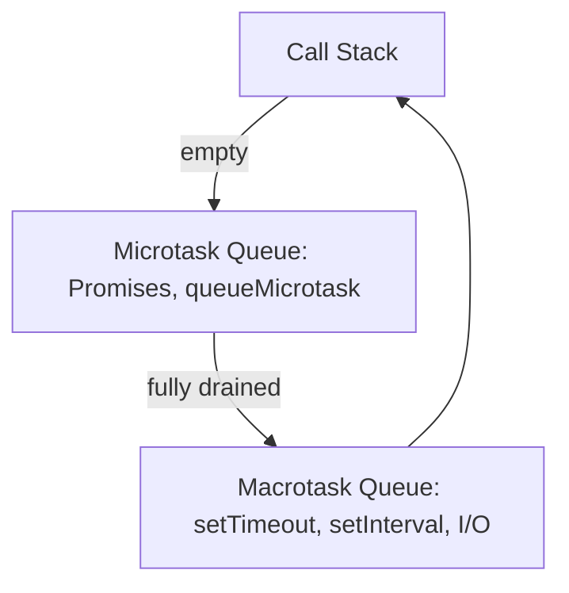
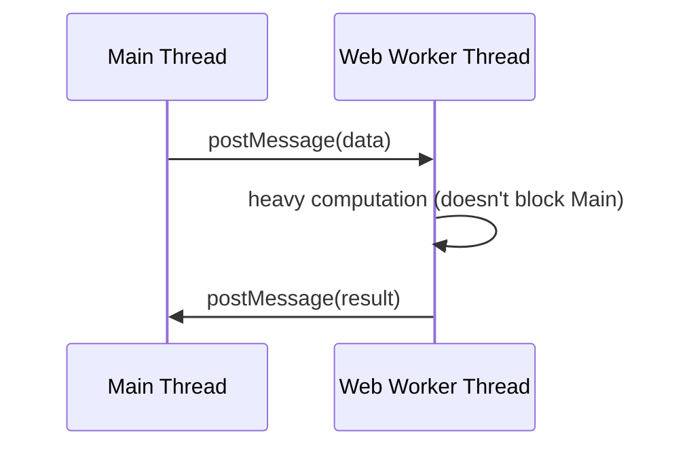
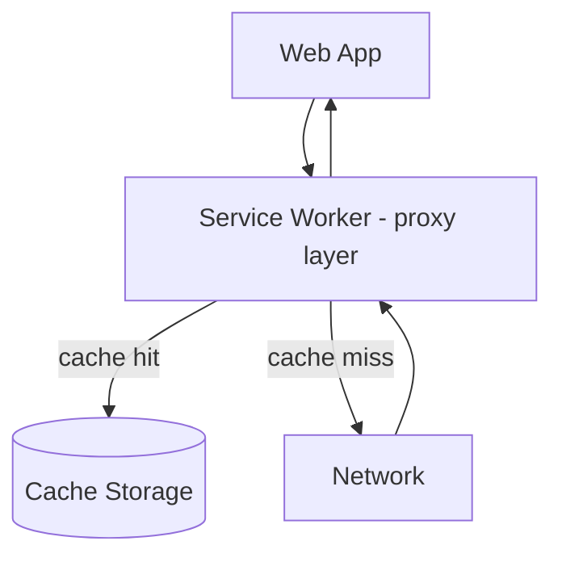
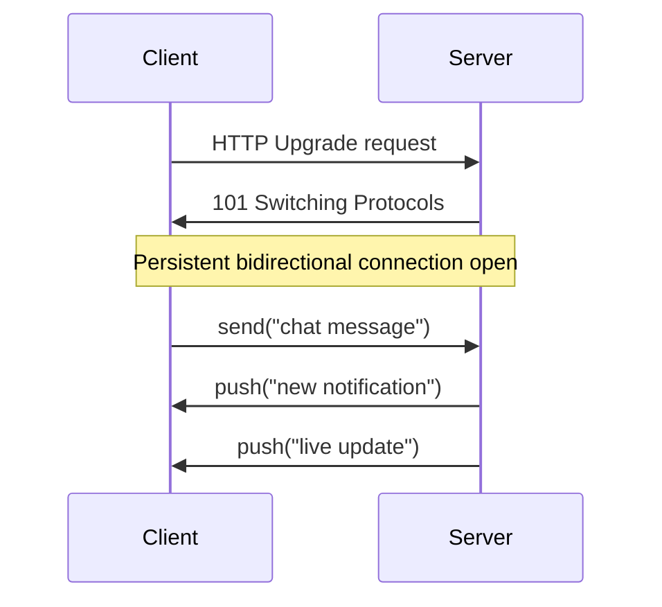
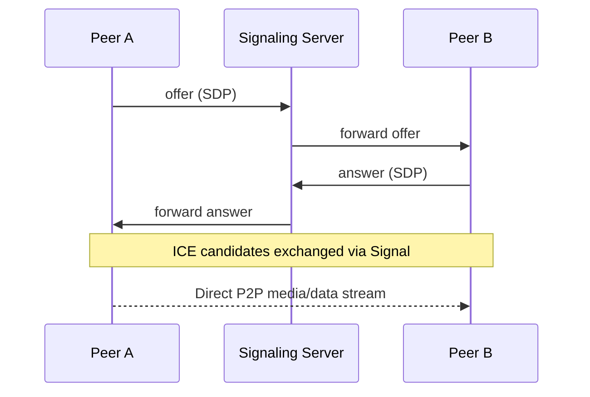
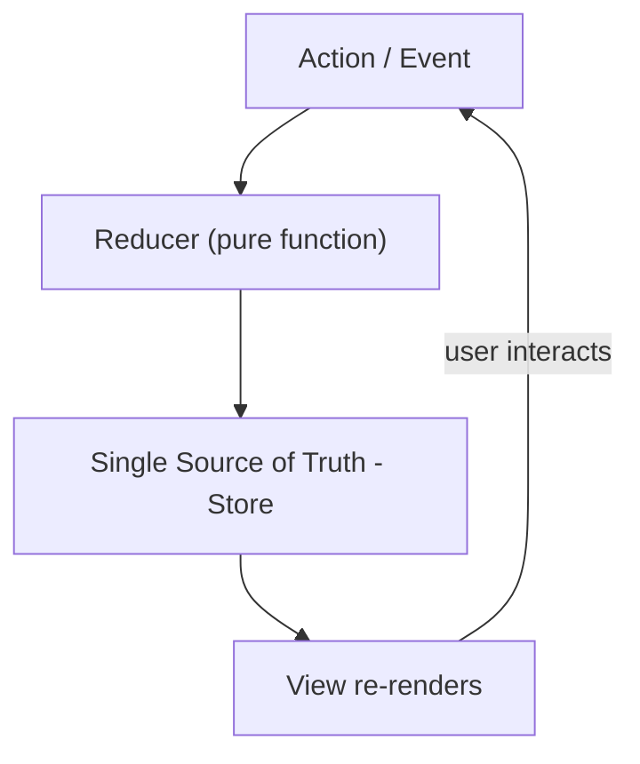
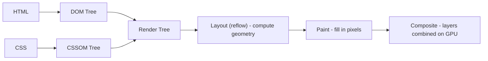
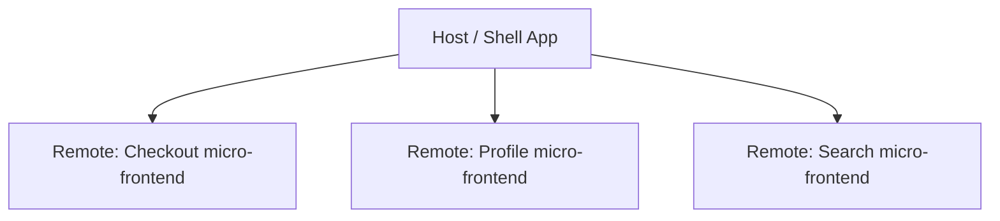

# 📕 JavaScript — Volume 5: Expert JavaScript

> Volume 4 covered how professionals build software. Volume 5 goes under the hood — deep async, real-time browser APIs, and how the engine itself works.

## 🧭 Map of this note


---

## 1. Advanced Async

Beyond basic `async/await` — understanding the **microtask vs macrotask** distinction and combinators.


Microtasks always fully drain **before** the next macrotask runs — this is why `Promise.resolve().then()` fires before `setTimeout(fn, 0)`.

```js
console.log("1");
setTimeout(() => console.log("2"), 0);      // macrotask
Promise.resolve().then(() => console.log("3")); // microtask
console.log("4");
// Output: 1, 4, 3, 2
```

Combinators:
```js
await Promise.all([p1, p2]);        // fails fast on first rejection
await Promise.allSettled([p1, p2]); // waits for all, never rejects
await Promise.race([p1, p2]);       // settles as soon as one settles
await Promise.any([p1, p2]);        // resolves on first fulfillment, ignores rejections until all reject
```

## 2. Streams

Process data **incrementally** instead of loading it all into memory at once — essential for large files, network responses, video.


```js
const response = await fetch("/large-file.json");
const reader = response.body.getReader();

while (true) {
  const { done, value } = await reader.read();
  if (done) break;
  console.log("chunk:", value.length, "bytes");
}
```
Backpressure is built in: a Writable stream can signal a Readable to pause production until it's ready for more.

## 3. Web Workers

Run JS on a **separate thread** — true parallelism, no shared memory (communication via message-passing / structured clone).



```js
// main.js
const worker = new Worker("worker.js");
worker.postMessage({ n: 40 });
worker.onmessage = (e) => console.log("Fibonacci:", e.data);

// worker.js
self.onmessage = (e) => {
  const result = fib(e.data.n);
  self.postMessage(result);
};
function fib(n) { return n < 2 ? n : fib(n - 1) + fib(n - 2); }
```

## 4. Service Workers

A special worker that sits **between the app and the network** — enables offline support, caching strategies, and push notifications.



```js
// registering
navigator.serviceWorker.register("/sw.js");

// sw.js — cache-first strategy
self.addEventListener("fetch", (event) => {
  event.respondWith(
    caches.match(event.request).then((cached) => cached || fetch(event.request))
  );
});
```

## 5. IndexedDB

A transactional, asynchronous, client-side **NoSQL** database in the browser — for large structured data (unlike `localStorage`, which is synchronous and string-only).

```js
const request = indexedDB.open("MyDB", 1);

request.onupgradeneeded = (e) => {
  const db = e.target.result;
  db.createObjectStore("users", { keyPath: "id" });
};

request.onsuccess = (e) => {
  const db = e.target.result;
  const tx = db.transaction("users", "readwrite");
  tx.objectStore("users").add({ id: 1, name: "Ada" });
};
```

## 6. WebSockets

Full-duplex, persistent connection — server can push data to the client without the client re-requesting (unlike HTTP polling).



```js
const socket = new WebSocket("wss://example.com/chat");
socket.onopen = () => socket.send("hello");
socket.onmessage = (event) => console.log("received:", event.data);
```

## 7. WebRTC

Peer-to-peer audio/video/data — no server relay needed for the media itself (server only used for initial "signaling" handshake).



```js
const pc = new RTCPeerConnection();
const offer = await pc.createOffer();
await pc.setLocalDescription(offer);
// send offer to remote peer via your own signaling channel (e.g. WebSocket)
```

## 8. GraphQL Client

Instead of many REST endpoints, one endpoint + a query describing exactly the shape of data needed — client controls the response shape.

```js
const query = `
  query GetUser($id: ID!) {
    user(id: $id) { name email posts { title } }
  }
`;

const res = await fetch("/graphql", {
  method: "POST",
  headers: { "Content-Type": "application/json" },
  body: JSON.stringify({ query, variables: { id: "1" } })
});
const { data } = await res.json();
```
Client libraries (Apollo Client, urql, Relay) add **normalized caching** — entities are cached by ID so updating one query can auto-update all others referencing the same entity.

## 9. Advanced Patterns

Beyond the classic GoF patterns (see [[17-Design-Patterns]]):

- **Compound Components** — components implicitly share state via context (common in React).
- **Render Props / Higher-Order Functions** — pass behavior as a function.
- **Dependency Injection** — pass dependencies in rather than hard-coding them, for testability.

```js
// Simple dependency injection
function createUserService(httpClient) {
  return {
    getUser: (id) => httpClient.get(`/users/${id}`)
  };
}
// tests can inject a fake httpClient instead of a real network call
```

## 10. State Management


The **unidirectional data flow** pattern (Redux, Zustand, Pinia, etc.): state changes only happen through explicit actions processed by pure reducer functions — never direct mutation — making state changes traceable and debuggable (time-travel debugging).

```js
function reducer(state, action) {
  switch (action.type) {
    case "increment": return { count: state.count + 1 };
    default: return state;
  }
}
```

## 11. Rendering Internals (Browser)


- **Reflow (layout)** — triggered by size/position changes; expensive, cascades to affected elements.
- **Repaint** — triggered by visual-only changes (color); cheaper than reflow.
- **Compositing** — GPU-accelerated changes (`transform`, `opacity`) skip layout AND paint entirely — this is why animating `transform` is far cheaper than animating `top`/`left`.

## 12. Browser Optimization

- Batch DOM reads and writes separately to avoid **layout thrashing** (repeated forced synchronous reflows).
```js
// ❌ Thrashing — read/write interleaved for each element
els.forEach(el => { el.style.width = el.offsetWidth + 10 + "px"; });

// ✅ Batch reads, then batch writes
const widths = els.map(el => el.offsetWidth);
els.forEach((el, i) => { el.style.width = widths[i] + 10 + "px"; });
```
- Prefer `transform`/`opacity` for animations (compositor-only, see above).
- Use `requestAnimationFrame` for visual updates, `requestIdleCallback` for non-urgent work.

## 13. Compiler Basics


JS engines are **JIT (Just-In-Time) compilers** — they don't fully compile ahead-of-time like C++; they start by interpreting, then compile "hot" (frequently run) code paths to optimized machine code on the fly.

## 14. JavaScript Internals (Engine Pipeline, e.g. V8)


- **Ignition** interprets bytecode quickly and gathers type feedback (what shapes/types actually flow through this code).
- **TurboFan** uses that feedback to generate highly optimized machine code — but only under the assumption those types stay consistent.
- **Deoptimization** happens if that assumption breaks (e.g. a function suddenly receives a different "shape" of object) — engine falls back to the slower interpreted path.

## 15. V8 Optimizations

- **Hidden Classes** — V8 assigns an internal "shape" (hidden class) to objects with the same structure, so property access can be an optimized offset lookup instead of a hash lookup.
```js
// ✅ Same hidden class both times — fast
function Point(x, y) { this.x = x; this.y = y; }
const p1 = new Point(1, 2);
const p2 = new Point(3, 4);

// ❌ Different property insertion order → different hidden classes → deopt risk
const a = {}; a.x = 1; a.y = 2;
const b = {}; b.y = 2; b.x = 1;
```
- **Inline Caching (IC)** — remembers the hidden class seen at a call site last time; if it matches again, skips the full property lookup ("monomorphic" = fast, "megamorphic" = slow, too many different shapes seen).
- **Avoid**: changing an object's shape after creation (`delete obj.prop`), mixing types in the same array (breaks a "packed" fast array into a slower generic one).

## 16. Enterprise Techniques

- **Feature flags** — ship code dark, enable per user/segment without a redeploy.
- **Micro-frontends** — independently deployable frontend modules, often loaded via **Module Federation** (Webpack 5+) so multiple teams ship separately but compose into one app at runtime.

- **Observability** — structured logging, distributed tracing (trace IDs across services), real-user monitoring (Core Web Vitals: LCP, INP, CLS).
- **Progressive rollout** — canary releases, A/B testing infrastructure, automated rollback on error-rate spikes.

## Quick Recall
- Microtasks (Promises) always drain fully before the next macrotask (`setTimeout`) runs.
- Web Workers = parallel threads with message-passing; Service Workers = a network proxy layer for offline/caching, not for parallel compute.
- `transform`/`opacity` animations skip layout & paint (compositor-only) — the cheapest way to animate.
- V8: Ignition interprets + profiles → TurboFan optimizes hot code → deoptimizes back to Ignition if type assumptions break.
- Keep object shapes consistent (same properties, same insertion order) to keep V8's hidden classes and inline caches fast.

**Related:** [[00-Index]] · [[Volume4-Professional-JavaScript]]
